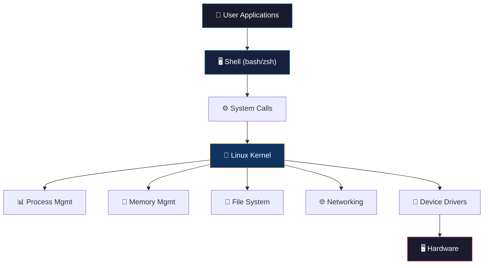

# 🐧 Linux Fundamentals

> **Linux powers over 90% of the world's servers, all Android devices, and most of the cloud. Mastering it is non-negotiable for any DevOps/SRE engineer.**

<p align="center">
  
  
</p>

---

## 📋 Table of Contents

- [Conceptual Overview](#-conceptual-overview)
- [Key Concepts](#-key-concepts)
- [Hands-on Lab](#-hands-on-lab)
- [Real-world Use Case](#-real-world-use-case)
- [Common Pitfalls](#-common-pitfalls)
- [Further Reading](#-further-reading)

---

## 📖 Conceptual Overview

Linux is an open-source operating system kernel that forms the foundation of most production infrastructure. As a DevOps/SRE engineer, you'll spend significant time in the Linux terminal — debugging, deploying, and automating.

### Linux Architecture



---

## 🔑 Key Concepts

### File System Hierarchy

| Path | Purpose | Example |
|------|---------|---------|
| `/` | Root of everything | — |
| `/home` | User home directories | `/home/ubuntu` |
| `/etc` | Configuration files | `/etc/nginx/nginx.conf` |
| `/var` | Variable data (logs, databases) | `/var/log/syslog` |
| `/tmp` | Temporary files (cleared on reboot) | — |
| `/opt` | Optional/third-party software | `/opt/prometheus` |
| `/usr/bin` | User binaries | `/usr/bin/python3` |
| `/proc` | Virtual filesystem (process info) | `/proc/cpuinfo` |

### Essential Commands Cheat Sheet

#### File Operations
```bash
# Navigate
cd /var/log          # Change directory
pwd                  # Print working directory
ls -lah              # List all files with details + human-readable sizes

# File manipulation
cp -r source/ dest/  # Copy recursively
mv old.txt new.txt   # Move/rename
rm -rf directory/    # Remove recursively (⚠️ DANGEROUS)
find / -name "*.log" -mtime +7  # Find logs older than 7 days

# View files
cat file.txt         # Print entire file
less file.txt        # Paginated viewer
head -n 20 file.txt  # First 20 lines
tail -f /var/log/app.log  # Follow log in real-time (critical for debugging!)
```

#### Process Management
```bash
# View processes
ps aux               # All processes
ps aux | grep nginx  # Find specific process
top                  # Real-time process viewer
htop                 # Better process viewer (install separately)

# Process control
kill <PID>           # Graceful stop (SIGTERM)
kill -9 <PID>        # Force kill (SIGKILL) — last resort!
nohup ./script.sh &  # Run in background, survives logout

# System resources
free -h              # Memory usage
df -h                # Disk usage
du -sh /var/log/*    # Directory sizes
uptime               # System uptime and load averages
```

#### Permissions
```bash
# Format: rwx rwx rwx = owner group others
# r=read(4) w=write(2) x=execute(1)

chmod 755 script.sh   # Owner: rwx, Group: r-x, Others: r-x
chmod +x script.sh    # Add execute permission
chown user:group file # Change ownership

# Common permission patterns
# 755 — Executables and directories
# 644 — Regular files
# 600 — Sensitive files (SSH keys, configs with secrets)
# 400 — Read-only sensitive files
```

#### Text Processing (The Power Tools)
```bash
# grep — Search text
grep -r "ERROR" /var/log/       # Recursive search
grep -i "timeout" app.log       # Case-insensitive
grep -c "500" access.log        # Count matches

# awk — Column extraction
awk '{print $1, $9}' access.log # Print IP and status code
awk '$9 >= 500' access.log      # Filter 5xx errors

# sed — Stream editing
sed -i 's/old/new/g' config.yml # Replace in-place
sed -n '10,20p' file.txt        # Print lines 10-20

# Pipes — Chain commands (the Unix philosophy!)
cat access.log | grep "500" | awk '{print $1}' | sort | uniq -c | sort -rn | head -10
# Translation: "Show me the top 10 IPs causing 500 errors"
```

### Systemd — Service Management

```bash
# Service lifecycle
systemctl start nginx       # Start a service
systemctl stop nginx        # Stop a service
systemctl restart nginx     # Restart
systemctl reload nginx      # Reload config without downtime
systemctl status nginx      # Check status

# Enable/Disable on boot
systemctl enable nginx      # Start on boot
systemctl disable nginx     # Don't start on boot

# View logs (journald)
journalctl -u nginx -f              # Follow service logs
journalctl -u nginx --since "1h ago" # Last hour's logs
journalctl -u nginx -p err          # Only error-level logs
```

---

## 🔧 Hands-on Lab

### Lab: Debugging a Production Issue via CLI

**Scenario:** Your monitoring shows high CPU and the app is slow. Debug using only the command line.

```bash
# Step 1: Check system load
uptime
# Output: load average: 8.52, 7.31, 4.20
# (4 CPU system — load > 4 means overloaded)

# Step 2: Find the culprit process
top -o %CPU -bn1 | head -15

# Step 3: Check if it's I/O related
iostat -x 1 3
# Look for %util > 80% on any disk

# Step 4: Check memory pressure
free -h
# Is swap being used heavily? That's a red flag.

# Step 5: Check for zombie processes
ps aux | awk '$8 ~ /Z/ {print}'

# Step 6: Check disk space (full disk = many weird failures)
df -h
# Any filesystem at 90%+? Investigate immediately.

# Step 7: Check recent logs for clues
journalctl --since "30 min ago" -p err
tail -100 /var/log/syslog | grep -i "error\|fail\|oom\|kill"

# Step 8: Check network connections
ss -tlnp    # Listening ports
ss -s       # Connection summary (too many TIME_WAIT?)
```

---

## 🏢 Real-world Use Case

### How Google SREs Use Linux

Every Google SRE is expected to be proficient in Linux:
- **Debugging with `/proc`** — Reading `/proc/<pid>/status`, `/proc/<pid>/fd` to understand process behavior
- **Performance analysis** — Using `perf`, `strace`, `bpftrace` for deep system analysis
- **Kernel tuning** — Adjusting `sysctl` parameters for high-throughput systems (TCP buffer sizes, file descriptor limits)

---

## ⚠️ Common Pitfalls

| # | Pitfall | How to Avoid |
|---|---------|-------------|
| 1 | `rm -rf /` (deleting everything) | Use `rm -rf` with extreme care; enable `trash-cli` |
| 2 | Running everything as root | Use `sudo` for specific commands, create service accounts |
| 3 | Ignoring log rotation | Configure `logrotate` — full disks cause outages |
| 4 | Not knowing `ctrl+c` vs `ctrl+z` | `ctrl+c` = terminate, `ctrl+z` = suspend (use `fg` to resume) |
| 5 | Hardcoding paths in scripts | Use variables and `$(which <cmd>)` |

---

## 📚 Further Reading

| Resource | Type | Description |
|----------|------|-------------|
| [Linux Journey](https://linuxjourney.com/) | 🎓 Course | Interactive Linux learning |
| [The Linux Command Line](https://linuxcommand.org/tlcl.php) | 📘 Book | Free, comprehensive CLI guide |
| [Brendan Gregg's Linux Perf](https://www.brendangregg.com/linuxperf.html) | 📖 Reference | Performance analysis tools |
| [ExplainShell](https://explainshell.com/) | 🔧 Tool | Explains any shell command |
| [OverTheWire Bandit](https://overthewire.org/wargames/bandit/) | 🎮 Game | Learn Linux through CTF challenges |

---

<p align="center">
  <a href="../README.md">⬅️ DevOps Home</a> · <a href="../02-networking-basics/README.md">Next: Networking ➡️</a>
</p>
