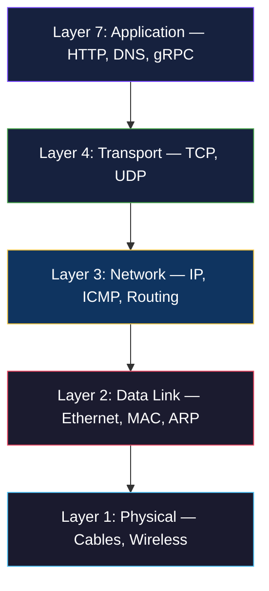
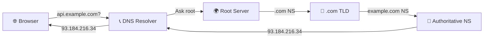
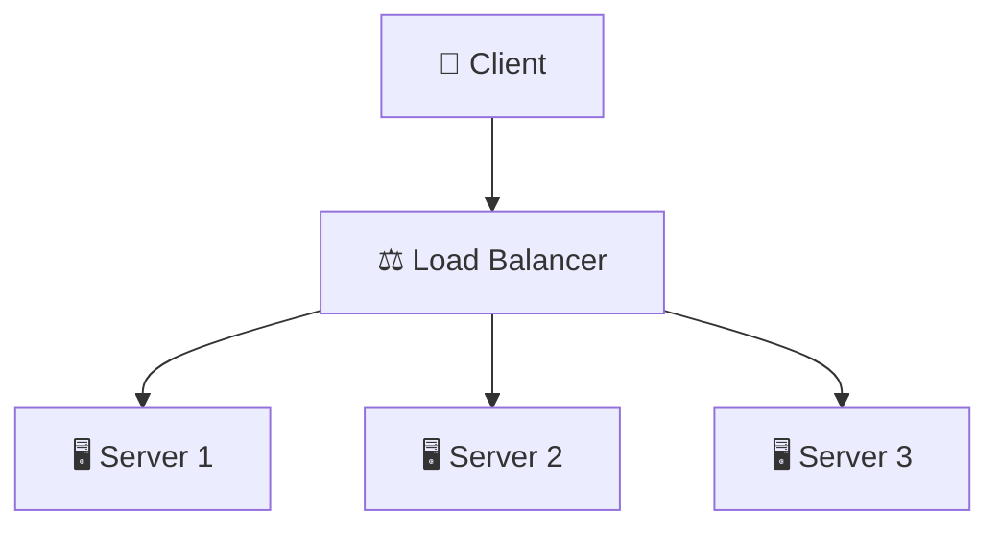

# 🌐 Networking Basics

> **Every packet your application sends traverses a complex network stack. Understanding networking is essential for debugging connectivity issues, designing resilient architectures, and securing your infrastructure.**

<p align="center">
  
  
</p>

---

## 📖 Conceptual Overview

### The OSI Model — Simplified for DevOps



| Layer | DevOps Relevance | Debugging Tools |
|-------|-----------------|-----------------|
| **L7 Application** | API calls, service mesh, ingress | `curl`, `httpie`, browser DevTools |
| **L4 Transport** | Load balancing, port mapping, firewalls | `ss`, `netstat`, `tcpdump` |
| **L3 Network** | VPC design, subnets, routing, NAT | `ping`, `traceroute`, `ip route` |
| **L2 Data Link** | ARP, MAC addresses (rarely needed) | `arp`, `ip neigh` |

---

## 🔑 Key Concepts

### DNS — The Internet's Phone Book



**DNS Record Types:**

| Type | Purpose | Example |
|------|---------|---------|
| **A** | Domain → IPv4 | `api.example.com → 93.184.216.34` |
| **AAAA** | Domain → IPv6 | `api.example.com → 2606:2800:220:1:...` |
| **CNAME** | Domain → Domain (alias) | `www.example.com → example.com` |
| **MX** | Mail server | `example.com → mail.example.com` |
| **TXT** | Arbitrary text (SPF, DKIM) | `v=spf1 include:_spf.google.com` |
| **NS** | Nameserver delegation | `example.com → ns1.cloudflare.com` |

```bash
# DNS debugging commands
dig api.example.com            # Full DNS query
dig +short api.example.com     # Just the IP
nslookup api.example.com       # Alternative tool
dig @8.8.8.8 api.example.com   # Query specific DNS server
```

### TCP vs UDP

| Feature | TCP | UDP |
|---------|-----|-----|
| **Connection** | Connection-oriented (3-way handshake) | Connectionless |
| **Reliability** | Guaranteed delivery, ordering | Best-effort, no guarantees |
| **Speed** | Slower (overhead) | Faster (minimal overhead) |
| **Use Case** | HTTP, SSH, databases | DNS, video streaming, gaming |

### Load Balancing



| Algorithm | How It Works | Best For |
|-----------|-------------|----------|
| **Round Robin** | Rotate through servers sequentially | Equal-capacity servers |
| **Least Connections** | Send to server with fewest connections | Variable request times |
| **IP Hash** | Same client IP → same server | Session persistence |
| **Weighted** | Distribute based on server capacity | Mixed hardware |

**Layer 4 vs Layer 7 Load Balancing:**

| Feature | L4 (Transport) | L7 (Application) |
|---------|:--------------:|:-----------------:|
| **Speed** | ⚡ Very fast | 🐇 Fast |
| **Intelligence** | IP + Port only | Full HTTP awareness |
| **SSL Termination** | ❌ | ✅ |
| **Path-based routing** | ❌ | ✅ `/api` → backend |
| **Tools** | HAProxy (TCP), NLB | NGINX, ALB, Envoy |

---

## 🔧 Hands-on Lab

### Lab: Network Debugging Toolkit

```bash
# === CONNECTIVITY TESTING ===

# Ping — Basic connectivity (ICMP)
ping -c 4 google.com

# Traceroute — Path to destination (find where packets die)
traceroute api.example.com
# On Linux: mtr api.example.com (better, real-time traceroute)

# Curl — HTTP-level testing
curl -v https://api.example.com/health    # Verbose output
curl -o /dev/null -s -w "HTTP %{http_code} | Time: %{time_total}s\n" https://api.example.com
curl -k https://self-signed.example.com   # Skip SSL verification (testing only!)

# === PORT / CONNECTION TESTING ===

# Check listening ports
ss -tlnp                # TCP listening ports with process names
ss -s                   # Socket statistics summary

# Test if a port is reachable
nc -zv api.example.com 443    # Netcat connection test
telnet api.example.com 80     # Alternative port test

# === PACKET CAPTURE ===

# tcpdump — Capture network traffic
sudo tcpdump -i eth0 port 80 -n          # HTTP traffic
sudo tcpdump -i eth0 host 10.0.1.5 -w capture.pcap  # Save to file
# Then analyze with Wireshark: wireshark capture.pcap

# === FIREWALL ===

# iptables — View rules
sudo iptables -L -n -v

# UFW (simpler interface)
sudo ufw status verbose
sudo ufw allow 80/tcp
sudo ufw allow from 10.0.0.0/8 to any port 5432
```

---

## 🏢 Real-world Use Case

### How Cloudflare Handles DNS at Scale

Cloudflare handles **~35 million DNS queries per second**:
- Anycast routing — Same IP announced from 300+ data centers worldwide
- Clients automatically routed to nearest data center
- 1.1.1.1 public DNS resolver — Privacy-focused, ~12ms average latency

### VPC Design Patterns (AWS)

```
Production VPC (10.0.0.0/16)
├── Public Subnets (10.0.1-2.0/24) → ALB, NAT Gateway, Bastion
├── Private App Subnets (10.0.10-20.0/24) → ECS/EKS, EC2 Apps
├── Private DB Subnets (10.0.100-110.0/24) → RDS, ElastiCache
└── Transit Gateway → Connected to other VPCs
```

---

## ⚠️ Common Pitfalls

| # | Pitfall | How to Avoid |
|---|---------|-------------|
| 1 | DNS caching issues | Understand TTL; use `dig +nocache` to bypass |
| 2 | Security groups too permissive | Follow least privilege: never `0.0.0.0/0` on databases |
| 3 | Not understanding NAT | Private subnets need NAT GW for outbound internet |
| 4 | Ignoring DNS propagation | TTL changes take time; lower TTL before migrations |
| 5 | CIDR overlap between VPCs | Plan IP ranges upfront; use RFC 1918 ranges |

---

## 📚 Further Reading

| Resource | Type | Description |
|----------|------|-------------|
| [Computer Networking: A Top-Down Approach](https://www.pearson.com/en-us/subject-catalog/p/computer-networking/P200000003334) | 📘 Book | Gold standard networking textbook |
| [High Performance Browser Networking](https://hpbn.co/) | 📘 Free | Ilya Grigorik's free online book |
| [Cloudflare Learning Center](https://www.cloudflare.com/learning/) | 📖 Reference | Excellent networking explainers |
| [Subnet Calculator](https://www.subnet-calculator.com/) | 🔧 Tool | Visual CIDR calculator |
| [Julia Evans' Networking Zines](https://wizardzines.com/) | 📖 Zines | Fun, visual networking concepts |

---

<p align="center">
  <a href="../01-linux-fundamentals/README.md">⬅️ Previous: Linux</a> · <a href="../README.md">DevOps Home</a> · <a href="../03-git-version-control/README.md">Next: Git ➡️</a>
</p>
