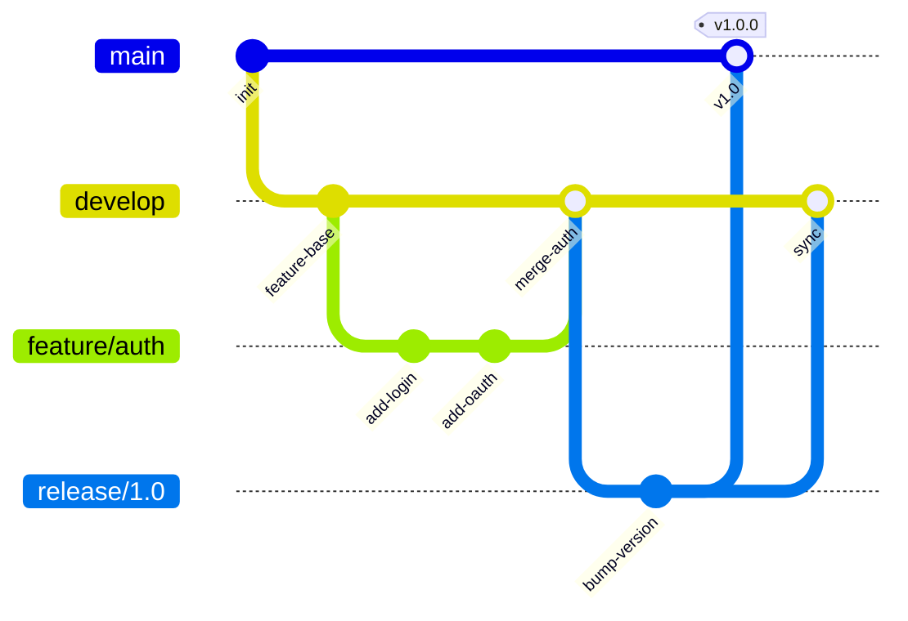

# 📦 Git & Version Control

> **Git is the lingua franca of modern software development. Every DevOps workflow begins with a `git push`.**

<p align="center">
  
  
</p>

---

## 📖 Conceptual Overview

Git is a **distributed version control system** — every developer has a full copy of the repository history, enabling offline work, fast branching, and resilient collaboration.


---

## 🔑 Key Concepts

### Branching Strategies

#### Git Flow



| Strategy | Branches | Best For | Complexity |
|----------|----------|----------|:----------:|
| **Git Flow** | main, develop, feature/*, release/*, hotfix/* | Scheduled releases | 🔴 High |
| **GitHub Flow** | main + feature branches | Continuous deployment | 🟢 Low |
| **Trunk-Based** | main + short-lived branches (< 1 day) | High-velocity teams | 🟢 Low |
| **GitLab Flow** | main + environment branches | Multi-environment deploys | 🟡 Medium |

> 💡 **Pro Tip:** For most teams, **trunk-based development** is the best choice. Google, Facebook, and Netflix all use trunk-based with feature flags.

### Essential Git Commands

```bash
# === DAILY WORKFLOW ===
git status                          # What's changed?
git diff                            # See unstaged changes
git add -p                          # Stage changes interactively (review each hunk)
git commit -m "feat: add auth"      # Commit with conventional message
git push origin feature/auth        # Push to remote

# === BRANCHING ===
git checkout -b feature/auth        # Create and switch to new branch
git branch -d feature/auth          # Delete branch (merged only)
git branch -D feature/auth          # Force delete (even if unmerged)

# === COLLABORATION ===
git pull --rebase origin main       # Pull with rebase (cleaner history)
git fetch origin                    # Download without merging
git merge --no-ff feature/auth      # Merge with merge commit

# === REWRITING HISTORY (use carefully!) ===
git rebase -i HEAD~3                # Interactive rebase last 3 commits
git commit --amend                  # Modify last commit
git stash                           # Temporarily save changes
git stash pop                       # Restore stashed changes

# === DEBUGGING ===
git log --oneline --graph -20       # Visual commit history
git blame file.py                   # Who changed each line?
git bisect start                    # Binary search for bug-introducing commit
git reflog                          # Recovery tool — shows ALL ref changes
```

### Conventional Commits

```
<type>(<scope>): <description>

Types:
  feat:     New feature
  fix:      Bug fix
  docs:     Documentation only
  style:    Formatting (no code change)
  refactor: Code restructuring
  test:     Adding tests
  chore:    Maintenance tasks
  ci:       CI/CD changes
  perf:     Performance improvements

Examples:
  feat(auth): add OAuth2 Google login
  fix(api): resolve timeout on /users endpoint
  docs(readme): add deployment instructions
  ci(actions): add Docker build caching
```

### Git Hooks — Automate Quality Checks

```bash
# .git/hooks/pre-commit (runs before every commit)
#!/bin/sh
npm run lint || exit 1        # Block commit if lint fails
npm test || exit 1            # Block commit if tests fail

# .git/hooks/commit-msg (validate commit messages)
#!/bin/sh
if ! grep -qE "^(feat|fix|docs|style|refactor|test|chore|ci|perf)(\(.+\))?: .{1,72}" "$1"; then
    echo "❌ Commit message must follow Conventional Commits format"
    exit 1
fi
```

> 💡 **Pro Tip:** Use [Husky](https://typicode.github.io/husky/) for Node.js or [pre-commit](https://pre-commit.com/) for Python to manage hooks across the team.

---

## 🔧 Hands-on Lab

### Lab: Resolve a Merge Conflict Like a Pro

```bash
# Step 1: Create conflicting changes
git checkout -b feature/a
echo "version = 2.0" > config.txt
git add . && git commit -m "feat: bump to v2.0"

git checkout main
echo "version = 3.0" > config.txt
git add . && git commit -m "feat: bump to v3.0"

# Step 2: Attempt merge
git merge feature/a
# CONFLICT! Both branches modified config.txt

# Step 3: Resolve the conflict
# Open config.txt — you'll see:
# <<<<<<< HEAD
# version = 3.0
# =======
# version = 2.0
# >>>>>>> feature/a

# Edit to resolve, then:
git add config.txt
git commit -m "fix: resolve version conflict, use v3.0"
```

---

## 🏢 Real-world Use Case

### Google's Monorepo

Google stores **billions of lines of code** in a single repository:
- **86 TB** of data, **2 billion lines** of code
- 25,000 engineers committing to one repo
- Custom version control system (Piper) built on top of similar concepts
- Every commit runs thousands of affected tests automatically

---

## ⚠️ Common Pitfalls

| # | Pitfall | How to Avoid |
|---|---------|-------------|
| 1 | Committing secrets (.env, API keys) | Use `.gitignore`; install `git-secrets` or `gitleaks` |
| 2 | Force-pushing to shared branches | Never `git push --force` on `main`; use `--force-with-lease` |
| 3 | Giant commits ("update everything") | Make small, focused commits with clear messages |
| 4 | Long-lived feature branches | Merge daily; use feature flags for incomplete features |
| 5 | Not using `.gitignore` | Create it **before** first commit |

---

## 📚 Further Reading

| Resource | Type | Description |
|----------|------|-------------|
| [Pro Git Book](https://git-scm.com/book/en/v2) | 📘 Free Book | The definitive Git reference |
| [Oh Shit, Git!?!](https://ohshitgit.com/) | 📖 Guide | How to undo Git mistakes |
| [Learn Git Branching](https://learngitbranching.js.org/) | 🎮 Interactive | Visual, interactive Git tutorial |
| [Conventional Commits](https://www.conventionalcommits.org/) | 📖 Spec | Commit message standard |
| [GitLens (VS Code)](https://marketplace.visualstudio.com/items?itemName=eamodio.gitlens) | 🔧 Tool | Git supercharged in VS Code |

---

<p align="center">
  <a href="../02-networking-basics/README.md">⬅️ Previous: Networking</a> · <a href="../README.md">DevOps Home</a> · <a href="../04-ci-cd-pipelines/README.md">Next: CI/CD ➡️</a>
</p>
