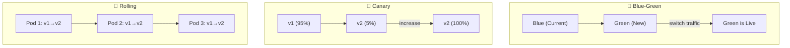

# ⚡ CI/CD Pipelines

> **Continuous Integration and Continuous Delivery/Deployment — the backbone of modern software delivery.**

<p align="center">
  
  
</p>

---

## 📋 Table of Contents

- [Conceptual Overview](#-conceptual-overview)
- [Key Concepts](#-key-concepts)
- [Hands-on Lab](#-hands-on-lab)
- [Real-world Use Case](#-real-world-use-case)
- [Common Pitfalls](#-common-pitfalls)
- [Further Reading](#-further-reading)

---

## 📖 Conceptual Overview

**CI/CD** is a method of frequently delivering apps by introducing automation into the stages of app development. It is the combined practices of **Continuous Integration (CI)** and **Continuous Delivery/Deployment (CD)**.

```mermaid
graph LR
    A["👨‍💻 Code"] -->|"git push"| B["📦 Source Control"]
    B -->|"trigger"| C["🔨 Build"]
    C --> D["🧪 Test"]
    D --> E["📊 Code Quality"]
    E --> F{"✅ Pass?"}
    F -->|"Yes"| G["📦 Package"]
    F -->|"No"| H["❌ Notify Dev"]
    G --> I["🚀 Deploy Staging"]
    I --> J["🧪 Integration Tests"]
    J --> K{"✅ Pass?"}
    K -->|"Yes"| L["🌍 Deploy Production"]
    K -->|"No"| H

    style A fill:#1a1a2e,stroke:#4fc3f7,color:#fff
    style B fill:#16213e,stroke:#7c4dff,color:#fff
    style C fill:#16213e,stroke:#7c4dff,color:#fff
    style D fill:#16213e,stroke:#43a047,color:#fff
    style E fill:#16213e,stroke:#43a047,color:#fff
    style F fill:#162447,stroke:#f4c542,color:#fff
    style G fill:#0f3460,stroke:#00e676,color:#fff
    style H fill:#b71c1c,stroke:#ef5350,color:#fff
    style I fill:#0f3460,stroke:#00e676,color:#fff
    style J fill:#0f3460,stroke:#43a047,color:#fff
    style K fill:#162447,stroke:#f4c542,color:#fff
    style L fill:#1b5e20,stroke:#43a047,color:#fff
```



### CI vs CD vs CD

| Term | Full Name | What It Does |
|------|-----------|-------------|
| **CI** | Continuous Integration | Automatically build and test on every commit |
| **CD** | Continuous Delivery | Automatically prepare releases for deployment (manual approval) |
| **CD** | Continuous Deployment | Automatically deploy every passing change to production |

> 💡 **Pro Tip:** Start with CI + Continuous Delivery. Only move to Continuous Deployment when you have sufficient test coverage and monitoring in place.

---

## 🔑 Key Concepts

### Pipeline Stages

| Stage | Purpose | Tools |
|-------|---------|-------|
| **Source** | Trigger pipeline on code changes | GitHub, GitLab, Bitbucket |
| **Build** | Compile code, create artifacts | Maven, Gradle, npm, Docker |
| **Test** | Run unit, integration, e2e tests | Jest, pytest, Selenium, Cypress |
| **Security** | SAST, DAST, dependency scanning | Snyk, Trivy, SonarQube |
| **Package** | Create deployable artifacts | Docker, Helm, AMI |
| **Deploy** | Release to environments | ArgoCD, Spinnaker, Flux |
| **Monitor** | Verify deployment health | Prometheus, Datadog, PagerDuty |

### Deployment Strategies



| Strategy | Zero Downtime | Rollback Speed | Risk Level |
|----------|:------------:|:--------------:|:----------:|
| **Recreate** | ❌ | 🐌 Slow | 🔴 High |
| **Rolling Update** | ✅ | 🐇 Medium | 🟡 Medium |
| **Blue-Green** | ✅ | ⚡ Instant | 🟢 Low |
| **Canary** | ✅ | ⚡ Instant | 🟢 Very Low |
| **A/B Testing** | ✅ | ⚡ Instant | 🟢 Very Low |

---

## 🔧 Hands-on Lab

### Lab 1: GitHub Actions — Multi-Stage Pipeline

**Objective:** Build a complete CI/CD pipeline with build, test, security scan, and deploy stages.

#### Prerequisites
- GitHub account
- A sample Node.js or Python application
- Docker Hub account (for container registry)

#### Step 1: Basic CI Pipeline

Create `.github/workflows/ci.yml`:

```yaml
# See: github-actions/basic-pipeline.yml in this directory
```

👉 **Full working file:** [basic-pipeline.yml](./github-actions/basic-pipeline.yml)

#### Step 2: Multi-Stage Production Pipeline

Create `.github/workflows/deploy.yml`:

```yaml
# See: github-actions/multi-stage-pipeline.yml in this directory  
```

👉 **Full working file:** [multi-stage-pipeline.yml](./github-actions/multi-stage-pipeline.yml)

#### Step 3: Jenkins Pipeline (Alternative)

👉 **Full working file:** [Jenkinsfile](./jenkins/Jenkinsfile)

#### Step 4: GitLab CI (Alternative)

👉 **Full working file:** [.gitlab-ci.yml](./gitlab-ci/.gitlab-ci.yml)

### Cleanup
- Delete test workflows from `.github/workflows/`
- Remove test Docker images from registry

---

## 🏢 Real-world Use Case

### How Netflix Deploys

Netflix uses **Spinnaker** (which they created) for CD:

1. **Commit** → Developer pushes to `main`
2. **Jenkins** builds and runs 10,000+ unit tests
3. **Spinnaker** creates an AMI (Amazon Machine Image)
4. **Canary deployment** → 1% of traffic goes to new version
5. **Automated analysis** → Kayenta compares metrics for 30 minutes
6. **Progressive rollout** → 5% → 25% → 100% if canary passes
7. **Auto-rollback** → If error rate exceeds threshold, instant rollback

> 🔑 **Key Takeaway:** Netflix deploys thousands of times per day across microservices. They achieve this through small batch sizes, automated canary analysis, and a culture of ownership.

### How Google Deploys

Google uses an internal tool called **Rapid**:
- All code lives in a single monorepo (billions of lines)
- Every change is reviewed by at least one other engineer
- Automated testing runs 4.2 million tests per day
- Deployments use progressive rollouts with automatic rollback

---

## ⚠️ Common Pitfalls

| # | Pitfall | Why It Happens | How to Avoid |
|---|---------|---------------|--------------|
| 1 | **Long-running pipelines** | Too many sequential steps, no caching | Parallelize stages, cache dependencies aggressively |
| 2 | **Flaky tests** | Tests depend on external services or timing | Use mocks, retry mechanisms, quarantine flaky tests |
| 3 | **Secrets in code** | Hardcoded credentials in configs | Use secret managers (Vault, AWS Secrets Manager) |
| 4 | **No rollback plan** | Only tested the happy path | Always test rollback before deploying forward |
| 5 | **Deploying on Fridays** | YOLO culture | Use deployment windows, feature flags instead |
| 6 | **Ignoring failed tests** | "It works on my machine" | Enforce pipeline gates — no merge if tests fail |
| 7 | **Monolithic pipelines** | One pipeline for everything | Split into per-service or per-component pipelines |

> 💡 **Pro Tip:** The #1 metric for CI/CD health is **pipeline duration**. If your pipeline takes more than 10 minutes, developers will start avoiding it. Target under 5 minutes for CI.

---

## 📚 Further Reading

| Resource | Type | Description |
|----------|------|-------------|
| [GitHub Actions Docs](https://docs.github.com/en/actions) | 📖 Docs | Official GitHub Actions documentation |
| [Jenkins Pipeline Syntax](https://www.jenkins.io/doc/book/pipeline/syntax/) | 📖 Docs | Declarative and scripted pipeline reference |
| [Continuous Delivery](https://continuousdelivery.com/) | 📘 Book | Jez Humble's seminal work on CD |
| [DORA Metrics](https://dora.dev/) | 📊 Research | The four key metrics for software delivery |
| [Spinnaker](https://spinnaker.io/) | 🔧 Tool | Netflix's open-source CD platform |
| [Tekton](https://tekton.dev/) | 🔧 Tool | Cloud-native CI/CD building blocks |

---

<p align="center">
  <a href="../README.md">⬅️ Back to DevOps</a> · <a href="../05-containerization/README.md">Next: Containerization ➡️</a>
</p>
