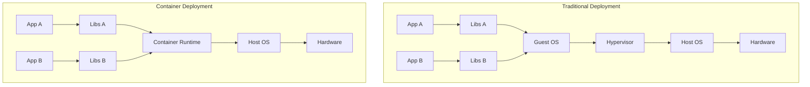
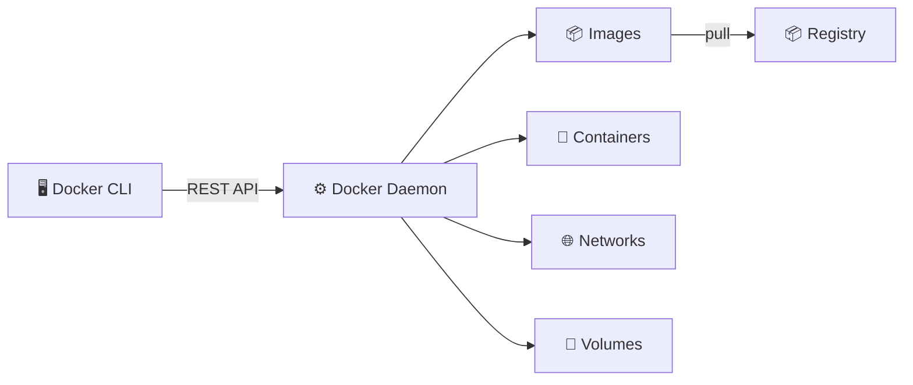

# 🐳 Containerization

> **Containerization is the packaging of software code with just the OS libraries and dependencies required to run the code, creating a single lightweight executable — a container.**

<p align="center">
  
  
</p>

---

## 📋 Table of Contents

- [Conceptual Overview](#-conceptual-overview)
- [Key Concepts](#-key-concepts)
- [Hands-on Lab](#-hands-on-lab)
- [Real-world Use Case](#-real-world-use-case)
- [Common Pitfalls](#-common-pitfalls)
- [Further Reading](#-further-reading)

---

## 📖 Conceptual Overview

Containers solve the **"works on my machine"** problem by bundling an application with everything it needs to run: code, runtime, system tools, libraries, and settings.



### VMs vs Containers

| Feature | Virtual Machines | Containers |
|---------|:---------------:|:----------:|
| **Boot Time** | Minutes | Seconds |
| **Size** | GBs | MBs |
| **Performance** | Near-native | Native |
| **Isolation** | 🟢 Strong (hardware) | 🟡 Process-level |
| **OS** | Full guest OS | Shared kernel |
| **Density** | ~10s per host | ~100s per host |
| **Use Case** | Legacy apps, strong isolation | Microservices, CI/CD |

> 💡 **Pro Tip:** Containers and VMs are not mutually exclusive. Many production environments run containers _inside_ VMs for defense-in-depth security.

---

## 🔑 Key Concepts

### Docker Architecture



### Image Layers

Docker images are built in **layers**. Each instruction in a Dockerfile creates a new layer:

```
┌──────────────────────┐
│ CMD ["node", "app"]  │  ← Runtime config (tiny)
├──────────────────────┤
│ COPY . /app          │  ← Your application code
├──────────────────────┤
│ RUN npm install      │  ← Dependencies (~200MB)
├──────────────────────┤
│ FROM node:20-alpine  │  ← Base image (~150MB)
└──────────────────────┘
```

> 💡 **Pro Tip:** Order your Dockerfile instructions from **least changing to most changing**. Docker caches layers, so unchanged layers are reused instantly.

### Multi-Stage Builds

Multi-stage builds dramatically reduce final image size by separating build-time dependencies from runtime:

```
Build Stage:          Final Stage:
┌──────────────┐     ┌──────────────┐
│ node:20      │     │ node:20-alpine│
│ npm install  │ ──→ │ /app (built) │
│ npm build    │     │ ~50MB total  │
│ ~800MB total │     └──────────────┘
└──────────────┘
```

---

## 🔧 Hands-on Lab

### Lab 1: Multi-Stage Docker Build

**Objective:** Build a production-optimized Docker image using multi-stage builds.

#### Prerequisites
- Docker installed ([Get Docker](https://docs.docker.com/get-docker/))
- Basic terminal knowledge

#### Step 1: Review the Dockerfile

👉 **Full working file:** [Dockerfile.multistage](./docker/Dockerfile.multistage)

Key techniques used:
- Multi-stage build (build stage → production stage)
- Non-root user for security
- Health checks
- `.dockerignore` to exclude unnecessary files

#### Step 2: Build the Image

```bash
# Build the image
docker build -f docker/Dockerfile.multistage -t myapp:latest .

# Check image size (should be ~50-100MB, not 800MB+)
docker images myapp

# Run the container
docker run -d -p 3000:3000 --name myapp myapp:latest

# Verify it's running
docker ps
curl http://localhost:3000/health

# Check logs
docker logs myapp

# Clean up
docker stop myapp && docker rm myapp
```

### Lab 2: Docker Compose for Development

👉 **Full working file:** [docker-compose.yml](./docker/docker-compose.yml)

```bash
# Start all services
docker compose up -d

# View logs
docker compose logs -f

# Check service status
docker compose ps

# Scale a service
docker compose up -d --scale api=3

# Tear down
docker compose down -v
```

### Cleanup

```bash
# Remove all stopped containers
docker container prune -f

# Remove unused images
docker image prune -f

# Nuclear option: remove everything
docker system prune -af --volumes
```

---

## 🏢 Real-world Use Case

### How Google Uses Containers

Google runs **everything** in containers — over **15 billion containers per week**. Their internal container orchestrator, **Borg**, inspired Kubernetes.

**Key practices:**
1. **Distroless images** — Google created [distroless](https://github.com/GoogleContainerTools/distroless) images that contain only the app and runtime, no shell, no package manager
2. **Binary authorization** — Every container must be built by their CI system and signed before it can run in production
3. **gVisor** — A container sandbox that provides additional kernel-level isolation

### How Spotify Uses Containers

Spotify containerized their entire backend:
- **~1,800 microservices** running in containers
- Reduced deployment time from **hours to minutes**
- Engineers deploy independently without coordinating

---

## ⚠️ Common Pitfalls

| # | Pitfall | Why It Happens | How to Avoid |
|---|---------|---------------|--------------|
| 1 | **Huge images (1GB+)** | Using `ubuntu` or `node` base | Use `alpine` or `distroless` bases |
| 2 | **Running as root** | Default Docker behavior | Add `USER nonroot` in Dockerfile |
| 3 | **Secrets in images** | `ENV API_KEY=xxx` in Dockerfile | Use Docker secrets or mount at runtime |
| 4 | **No .dockerignore** | Copying `node_modules`, `.git` | Always create `.dockerignore` |
| 5 | **No health checks** | Container "running" but app crashed | Add `HEALTHCHECK` instruction |
| 6 | **Latest tag in prod** | `FROM node:latest` | Always pin versions: `FROM node:20.11-alpine` |
| 7 | **Not using multi-stage** | Build tools in production image | Separate build and runtime stages |

---

## 📚 Further Reading

| Resource | Type | Description |
|----------|------|-------------|
| [Docker Docs](https://docs.docker.com/) | 📖 Docs | Official documentation |
| [Dockerfile Best Practices](https://docs.docker.com/develop/develop-images/dockerfile_best-practices/) | 📖 Guide | Official best practices |
| [Distroless Images](https://github.com/GoogleContainerTools/distroless) | 🔧 Tool | Google's minimal container images |
| [Dive](https://github.com/wagoodman/dive) | 🔧 Tool | Explore Docker image layers |
| [Hadolint](https://github.com/hadolint/hadolint) | 🔧 Tool | Dockerfile linter |
| [Container Security](https://www.oreilly.com/library/view/container-security/9781492056690/) | 📘 Book | Liz Rice's container security guide |

---

<p align="center">
  <a href="../04-ci-cd-pipelines/README.md">⬅️ Previous: CI/CD</a> · <a href="../README.md">DevOps Home</a> · <a href="../07-infrastructure-as-code/README.md">Next: IaC ➡️</a>
</p>
