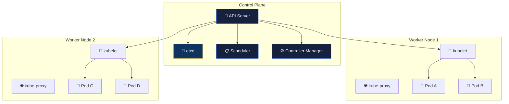
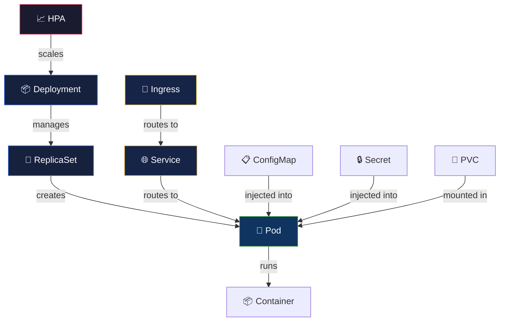

# ☸️ Container Orchestration — Kubernetes

> **Kubernetes (K8s) is the industry-standard platform for automating deployment, scaling, and management of containerized applications.**

<p align="center">
  
  
  
</p>

---

## 📋 Table of Contents

- [Conceptual Overview](#-conceptual-overview)
- [Key Concepts](#-key-concepts)
- [Hands-on Lab](#-hands-on-lab)
- [Real-world Use Case](#-real-world-use-case)
- [Common Pitfalls](#-common-pitfalls)
- [Further Reading](#-further-reading)

---

## 📖 Conceptual Overview

Kubernetes automates the hard parts of running containers at scale: scheduling, self-healing, scaling, networking, and storage orchestration.

### K8s Architecture



| Component | Role |
|-----------|------|
| **API Server** | Front door to the cluster — all operations go through it |
| **etcd** | Key-value store holding all cluster state |
| **Scheduler** | Assigns pods to nodes based on resource requirements |
| **Controller Manager** | Ensures desired state matches actual state |
| **kubelet** | Agent on each node that manages pods |
| **kube-proxy** | Network rules for pod-to-pod communication |

---

## 🔑 Key Concepts

### Core Resources



| Resource | Purpose | When to Use |
|----------|---------|------------|
| **Pod** | Smallest deployable unit (1+ containers) | Never create directly — use Deployments |
| **Deployment** | Manages ReplicaSets, handles rollouts | Stateless applications |
| **StatefulSet** | Like Deployment but with stable identity | Databases, Kafka, Zookeeper |
| **DaemonSet** | One pod per node | Log collectors, monitoring agents |
| **Service** | Stable networking endpoint for pods | Always — pods get new IPs on restart |
| **Ingress** | HTTP(S) routing from external traffic | Web applications, APIs |
| **ConfigMap** | Non-sensitive configuration | App config, environment variables |
| **Secret** | Sensitive data (base64 encoded) | Passwords, API keys, TLS certs |
| **HPA** | Horizontal Pod Autoscaler | Auto-scale based on CPU/memory/custom |
| **NetworkPolicy** | Pod-level firewall rules | Restrict pod-to-pod communication |

### Service Types

| Type | Access From | Use Case |
|------|------------|----------|
| **ClusterIP** | Inside cluster only | Inter-service communication |
| **NodePort** | External via `<NodeIP>:Port` | Development/testing |
| **LoadBalancer** | External via cloud LB | Production external services |
| **ExternalName** | DNS CNAME redirect | Connecting to external services |

---

## 🔧 Hands-on Lab

### Lab: Deploy a Production-Ready Microservice

#### Prerequisites
```bash
# Install minikube (local K8s) or use kind
# macOS:
brew install minikube
minikube start --cpus=2 --memory=4096

# Or use kind (Kubernetes in Docker):
kind create cluster --name zero-to-sre
```

#### Step 1: Deployment Manifest

👉 **Working file:** [deployment.yaml](./k8s-manifests/deployment.yaml)

```yaml
# See k8s-manifests/deployment.yaml
```

#### Step 2: Service & Ingress

👉 **Working files:** [service.yaml](./k8s-manifests/service.yaml), [ingress.yaml](./k8s-manifests/ingress.yaml)

#### Step 3: Autoscaling

👉 **Working file:** [hpa.yaml](./k8s-manifests/hpa.yaml)

#### Step 4: Network Security

👉 **Working file:** [network-policy.yaml](./k8s-manifests/network-policy.yaml)

#### Apply Everything

```bash
# Apply all manifests
kubectl apply -f k8s-manifests/

# Verify
kubectl get all -n production
kubectl describe deployment myapp -n production

# Watch pods
kubectl get pods -n production -w

# Test the service
kubectl port-forward svc/myapp 8080:80 -n production
curl http://localhost:8080/health

# Check HPA
kubectl get hpa -n production

# View logs
kubectl logs -f deployment/myapp -n production

# Execute into a pod (debugging)
kubectl exec -it <pod-name> -n production -- sh
```

#### Rollout & Rollback

```bash
# Update image (triggers rolling update)
kubectl set image deployment/myapp app=myapp:v2 -n production

# Watch rollout progress
kubectl rollout status deployment/myapp -n production

# View rollout history
kubectl rollout history deployment/myapp -n production

# Rollback to previous version
kubectl rollout undo deployment/myapp -n production

# Rollback to specific revision
kubectl rollout undo deployment/myapp --to-revision=2 -n production
```

#### Cleanup
```bash
kubectl delete -f k8s-manifests/
minikube delete  # or: kind delete cluster --name zero-to-sre
```

---

## 🏢 Real-world Use Case

### How Spotify Runs Kubernetes

Spotify migrated ~1,800 microservices to Kubernetes:
- **150+ Kubernetes clusters** across GCP
- Custom platform built on top of K8s with **Backstage** (their open-source IDP)
- Engineers deploy via a self-service portal — never touch kubectl directly
- Average deployment time dropped from **hours to minutes**

### How Airbnb Scaled to 1,000+ Services on K8s

- Migrated from a monolith to **1,000+ services** on Kubernetes
- Built **OneTouch** — internal deployment platform abstracting K8s complexity
- Key metric: 99.99% deployment success rate
- Custom autoscaling based on business metrics (bookings/minute)

---

## ⚠️ Common Pitfalls

| # | Pitfall | How to Avoid |
|---|---------|-------------|
| 1 | No resource requests/limits | Always set them — prevents noisy neighbor problems |
| 2 | Using `latest` image tag | Pin specific versions for reproducibility |
| 3 | No readiness probes | Without them, traffic hits pods before they're ready |
| 4 | Single replica in production | Run ≥2 replicas with pod anti-affinity |
| 5 | Storing state in pods | Use external databases/storage — pods are ephemeral |
| 6 | Not setting PodDisruptionBudgets | K8s can evict all pods during node maintenance |
| 7 | Overly permissive RBAC | Follow least privilege — use namespace-scoped roles |
| 8 | Ignoring pod security | Set `runAsNonRoot: true`, `readOnlyRootFilesystem: true` |

---

## 📚 Further Reading

| Resource | Type | Description |
|----------|------|-------------|
| [Kubernetes Docs](https://kubernetes.io/docs/) | 📖 Docs | Official documentation |
| [Kubernetes the Hard Way](https://github.com/kelseyhightower/kubernetes-the-hard-way) | 🧪 Lab | Build K8s from scratch (by Kelsey Hightower) |
| [Kubernetes Patterns](https://www.oreilly.com/library/view/kubernetes-patterns-2nd/9781098131678/) | 📘 Book | Design patterns for K8s |
| [Lens](https://k8slens.dev/) | 🔧 Tool | Kubernetes IDE |
| [k9s](https://k9scli.io/) | 🔧 Tool | Terminal UI for K8s |
| [Kustomize](https://kustomize.io/) | 🔧 Tool | Template-free K8s customization |
| [CKAD Exam Prep](https://github.com/dgkanatsios/CKAD-exercises) | 🎓 Study | Practice exercises for CKAD cert |

---

<p align="center">
  <a href="../05-containerization/README.md">⬅️ Previous: Containerization</a> · <a href="../README.md">DevOps Home</a> · <a href="../07-infrastructure-as-code/README.md">Next: IaC ➡️</a>
</p>
