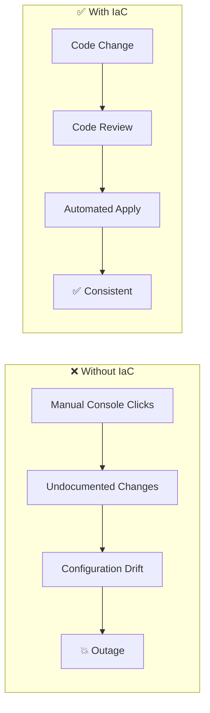

# 🏗️ Infrastructure as Code (IaC)

> **Infrastructure as Code is the practice of managing and provisioning infrastructure through machine-readable definition files, rather than manual processes.**

<p align="center">
  
  
</p>

---

## 📋 Table of Contents

- [Conceptual Overview](#-conceptual-overview)
- [Key Concepts](#-key-concepts)
- [Hands-on Lab](#-hands-on-lab)
- [Real-world Use Case](#-real-world-use-case)
- [Common Pitfalls](#-common-pitfalls)
- [Further Reading](#-further-reading)

---

## 📖 Conceptual Overview

IaC brings **software engineering practices** to infrastructure management. Instead of clicking through cloud consoles or running ad-hoc scripts, you define your entire infrastructure in version-controlled files.

### Why IaC?



| Without IaC | With IaC |
|-------------|----------|
| ❌ "Who changed the firewall rules?" | ✅ Git blame shows who, when, and why |
| ❌ Snowflake servers | ✅ Identical environments |
| ❌ Manual disaster recovery | ✅ `terraform apply` and you're back |
| ❌ Hours to set up new env | ✅ Minutes with code |

### IaC Tool Landscape

| Tool | Type | Language | State | Best For |
|------|------|----------|-------|----------|
| **Terraform** | Declarative | HCL | Remote/Local | Multi-cloud, most popular |
| **Pulumi** | Declarative | Python/TS/Go | Cloud | Developers who prefer real languages |
| **CloudFormation** | Declarative | YAML/JSON | AWS-managed | AWS-only shops |
| **Ansible** | Imperative | YAML | Stateless | Config management + provisioning |
| **CDK** | Declarative | Python/TS | AWS-managed | AWS with familiar languages |
| **OpenTofu** | Declarative | HCL | Remote/Local | Open-source Terraform fork |

---

## 🔑 Key Concepts

### Terraform Core Workflow


### State Management

Terraform tracks the **current state** of your infrastructure in a state file. This is critical:

```
┌─────────────────┐      ┌──────────────────┐      ┌─────────────────┐
│ Desired State   │      │ Terraform State  │      │ Real World      │
│ (*.tf files)    │ ──→  │ (terraform.tfstate)│ ←── │ (Cloud Provider)│
│                 │      │                  │      │                 │
│ vpc, 3 subnets, │      │ Records IDs,     │      │ Actual AWS      │
│ 2 instances     │      │ attributes       │      │ resources       │
└─────────────────┘      └──────────────────┘      └─────────────────┘
```

> ⚠️ **Critical:** Never store state locally in production. Use remote backends (S3, GCS, Terraform Cloud).

---

## 🔧 Hands-on Lab

### Lab: Provision AWS VPC with Terraform

**Objective:** Create a production-ready VPC with public/private subnets, NAT gateway, and security groups.

#### Prerequisites
- [Terraform CLI](https://developer.hashicorp.com/terraform/install) installed
- AWS account with programmatic access
- AWS CLI configured (`aws configure`)

#### Step 1: Review the Configuration

The Terraform files are in the `terraform/aws-vpc/` directory:

| File | Purpose |
|------|---------|
| [main.tf](./terraform/aws-vpc/main.tf) | Core infrastructure resources |
| [variables.tf](./terraform/aws-vpc/variables.tf) | Input variables |
| [outputs.tf](./terraform/aws-vpc/outputs.tf) | Output values |

#### Step 2: Initialize and Apply

```bash
cd terraform/aws-vpc

# Initialize — downloads the AWS provider
terraform init

# Preview changes — ALWAYS review before applying
terraform plan -out=tfplan

# Apply the plan
terraform apply tfplan

# View outputs
terraform output
```

#### Step 3: Inspect State

```bash
# List all resources in state
terraform state list

# Show details of a specific resource
terraform state show aws_vpc.main

# Visualize the dependency graph
terraform graph | dot -Tpng > graph.png
```

#### Cleanup

```bash
# Destroy all resources
terraform destroy

# Confirm by typing 'yes'
```

---

## 🏢 Real-world Use Case

### How Netflix Manages Infrastructure

Netflix manages **hundreds of AWS accounts** with IaC:

1. **Custom tooling** — They use a combination of Terraform and custom internal tools
2. **Account vending** — New AWS accounts are provisioned entirely via IaC
3. **Immutable infrastructure** — Servers are never updated; instead, new ones replace old ones
4. **Blast radius reduction** — Each microservice gets its own AWS account to limit the impact of misconfigurations

### How Airbnb Scaled Terraform

Airbnb's journey with Terraform:
- Started with a **monolithic** Terraform repo
- Hit scaling limits at ~1000 resources
- Moved to **modular architecture** with separate repos per component
- Built internal tooling (`Terraformer`) to generate Terraform from existing infrastructure
- Key lesson: **Start modular from day one**

---

## ⚠️ Common Pitfalls

| # | Pitfall | Why It Happens | How to Avoid |
|---|---------|---------------|--------------|
| 1 | **State file in Git** | Seems convenient | Use remote backends (S3 + DynamoDB locking) |
| 2 | **No state locking** | Multiple `terraform apply` at once | Enable DynamoDB locking or use Terraform Cloud |
| 3 | **Hardcoded values** | Quick prototyping habits | Always use variables and locals |
| 4 | **Monolithic configs** | Started small, grew organically | Use modules from the beginning |
| 5 | **No `plan` before `apply`** | Trusting the code | Always run `plan` and review output |
| 6 | **Ignoring drift** | Manual console changes | Run `terraform plan` regularly to detect drift |
| 7 | **Not using workspaces** | Same state for all environments | Use workspaces or separate state files per env |
| 8 | **Secrets in .tf files** | Hard coding credentials | Use Vault, AWS Secrets Manager, or env vars |

> 💡 **Pro Tip:** Set up a CI/CD pipeline for Terraform that automatically runs `plan` on PRs and `apply` on merge to `main`. Tools like Atlantis or Terraform Cloud make this easy.

---

## 📚 Further Reading

| Resource | Type | Description |
|----------|------|-------------|
| [Terraform Docs](https://developer.hashicorp.com/terraform/docs) | 📖 Docs | Official documentation |
| [Terraform Best Practices](https://www.terraform-best-practices.com/) | 📖 Guide | Community best practices |
| [Terraform Up & Running](https://www.terraformupandrunning.com/) | 📘 Book | Yevgeniy Brikman's comprehensive guide |
| [OpenTofu](https://opentofu.org/) | 🔧 Tool | Open-source Terraform fork |
| [Terragrunt](https://terragrunt.gruntwork.io/) | 🔧 Tool | Thin wrapper for keeping Terraform DRY |
| [Infracost](https://www.infracost.io/) | 🔧 Tool | Cost estimation for Terraform |
| [tfsec](https://github.com/aquasecurity/tfsec) | 🔧 Tool | Security scanner for Terraform |

---

<p align="center">
  <a href="../05-containerization/README.md">⬅️ Previous: Containerization</a> · <a href="../README.md">DevOps Home</a>
</p>
