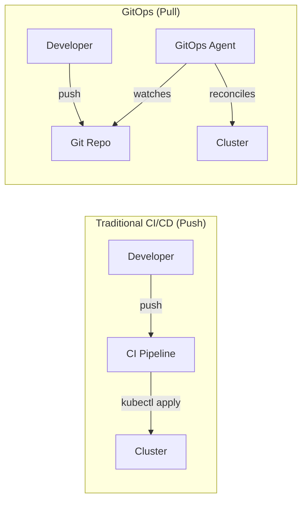

# 🔄 GitOps

> **GitOps is a set of practices where Git is the single source of truth for declarative infrastructure and applications. Changes are deployed by changing Git, not by running commands.**

<p align="center">
  
  
</p>

---

## 📖 Conceptual Overview

### Traditional vs GitOps Deployment



| Push Model (Traditional) | Pull Model (GitOps) |
|--------------------------|---------------------|
| CI pipeline has cluster credentials | Only GitOps agent has credentials |
| Manual drift possible | Automatic drift correction |
| Imperative commands | Declarative state |
| "I ran kubectl and..." | "Git log shows who, when, why" |

### GitOps Principles

1. **Declarative** — Desired state described in Git
2. **Versioned and Immutable** — Git history = audit trail
3. **Pulled Automatically** — Agents pull and reconcile
4. **Continuously Reconciled** — Drift is auto-corrected

---

## 🔑 Key Concepts

### Tool Comparison

| Feature | ArgoCD | FluxCD |
|---------|--------|--------|
| **UI** | ✅ Rich web UI | ❌ CLI only (Weave GitOps UI available) |
| **RBAC** | ✅ Built-in | Via Kubernetes RBAC |
| **Multi-cluster** | ✅ Native | ✅ Via Kustomize |
| **Helm Support** | ✅ | ✅ |
| **Image Automation** | Via Image Updater | ✅ Native |
| **Community** | Larger | Growing |
| **CNCF Status** | Graduated | Graduated |

---

## 🔧 Hands-on Lab

### Lab: ArgoCD Setup

```bash
# Install ArgoCD
kubectl create namespace argocd
kubectl apply -n argocd -f https://raw.githubusercontent.com/argoproj/argo-cd/stable/manifests/install.yaml

# Access the UI
kubectl port-forward svc/argocd-server -n argocd 8080:443

# Get initial admin password
kubectl -n argocd get secret argocd-initial-admin-secret -o jsonpath="{.data.password}" | base64 -d

# Login: https://localhost:8080 (admin / <password>)
```

#### ArgoCD Application Manifest

👉 **Working file:** [argocd/application.yaml](./argocd/application.yaml)

```bash
kubectl apply -f argocd/application.yaml
```

---

## 🏢 Real-world Use Case

### How Intuit Uses ArgoCD at Scale

Intuit (TurboTax, QuickBooks) manages **2,500+ applications** with ArgoCD:
- Single ArgoCD instance managing multiple clusters
- ApplicationSets for templating similar apps
- PR-based promotion: dev → staging → production via Git merge

---

## ⚠️ Common Pitfalls

| # | Pitfall | How to Avoid |
|---|---------|-------------|
| 1 | Secrets in Git | Use Sealed Secrets, SOPS, or External Secrets Operator |
| 2 | Single point of failure (ArgoCD) | Run ArgoCD in HA mode with multiple replicas |
| 3 | Too many manual overrides | Enforce "Git is the source of truth" policy |
| 4 | Not structuring repos properly | Separate app repos from config repos |

---

## 📚 Further Reading

| Resource | Type | Description |
|----------|------|-------------|
| [ArgoCD Docs](https://argo-cd.readthedocs.io/) | 📖 Docs | Official documentation |
| [FluxCD Docs](https://fluxcd.io/docs/) | 📖 Docs | Official documentation |
| [GitOps by Weaveworks](https://www.gitops.tech/) | 📖 Guide | GitOps principles |
| [Argo Rollouts](https://argoproj.github.io/rollouts/) | 🔧 Tool | Progressive delivery with ArgoCD |

---

<p align="center">
  <a href="../07-infrastructure-as-code/README.md">⬅️ Previous: IaC</a> · <a href="../README.md">DevOps Home</a> · <a href="../09-platform-engineering/README.md">Next: Platform Eng ➡️</a>
</p>
