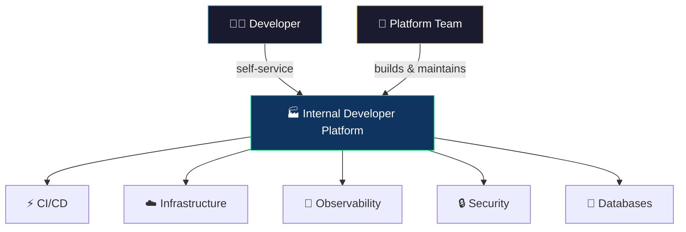

# 🏭 Platform Engineering

> **Platform engineering is the practice of building and maintaining internal developer platforms (IDPs) that enable self-service capabilities for software engineering teams.**

<p align="center">
  
  
</p>

---

## 📖 Conceptual Overview

Platform engineering is the **evolution of DevOps**. Instead of every team building their own tooling, a dedicated platform team builds a self-service platform that abstracts away infrastructure complexity.



### DevOps vs Platform Engineering

| DevOps | Platform Engineering |
|--------|---------------------|
| Every team manages their own infra | Platform team provides abstractions |
| "You build it, you run it" | "You build it, we help you run it" |
| High cognitive load on devs | Reduced cognitive load via golden paths |
| Freedom → inconsistency | Guardrails → consistency |

---

## 🔑 Key Concepts

### The Internal Developer Platform (IDP)

An IDP typically provides:

| Capability | What It Does | Tools |
|-----------|-------------|-------|
| **Service Catalog** | Discover and create services | Backstage, Port |
| **Golden Paths** | Opinionated, tested templates | Cookiecutter, Yeoman |
| **Self-Service Infra** | Provision databases, queues, etc. | Crossplane, Terraform modules |
| **CI/CD** | Automated build and deploy | ArgoCD, GitHub Actions |
| **Observability** | Built-in monitoring and logging | Grafana, Datadog |
| **Documentation** | Centralized, searchable docs | Backstage TechDocs |

### Backstage — The Leading IDP Framework

[Backstage](https://backstage.io/) (by Spotify, CNCF Incubating):

```
┌────────────────────────────────────────────────┐
│ Backstage                                       │
│                                                 │
│  📋 Software Catalog    │  📦 Templates         │
│  All services, owners   │  Create new services  │
│                         │  from golden paths    │
│  📖 TechDocs            │  🔌 Plugins           │
│  Docs-as-code           │  CI/CD, K8s, PagerDuty│
│                         │  costs, security      │
└────────────────────────────────────────────────┘
```

---

## 🏢 Real-world Use Case

### Spotify's Backstage Journey

- **Problem:** 1,800+ microservices, engineers couldn't find anything
- **Solution:** Built Backstage — a single pane of glass for all services
- **Impact:** New service creation: **weeks → 15 minutes**
- **Open-sourced** in 2020, now CNCF Incubating with 150+ company adopters

### Platform Engineering at Mercado Libre

- Largest e-commerce platform in Latin America
- **20,000+ developers** using their platform "Fury"
- Self-service provisioning of databases, caches, and messaging
- Standardized observability built into every service by default

---

## ⚠️ Common Pitfalls

| # | Pitfall | How to Avoid |
|---|---------|-------------|
| 1 | Building too much, too soon | Start with the highest-pain developer workflow |
| 2 | Not treating platform as a product | Survey your users (developers), iterate on feedback |
| 3 | Mandatory adoption | Make the platform so good that teams choose to use it |
| 4 | Ignoring developer experience | Measure: time to first deploy, satisfaction surveys |

---

## 📚 Further Reading

| Resource | Type | Description |
|----------|------|-------------|
| [Backstage](https://backstage.io/) | 🔧 Tool | Spotify's open-source IDP framework |
| [Team Topologies](https://teamtopologies.com/) | 📘 Book | How to organize teams around platforms |
| [Platform Engineering on K8s](https://www.manning.com/books/platform-engineering-on-kubernetes) | 📘 Book | Building platforms on Kubernetes |
| [platformengineering.org](https://platformengineering.org/) | 🌐 Community | Community resources and events |
| [CNCF Platforms White Paper](https://tag-app-delivery.cncf.io/whitepapers/platforms/) | 📄 Paper | CNCF definition of platforms |

---

<p align="center">
  <a href="../08-gitops/README.md">⬅️ Previous: GitOps</a> · <a href="../README.md">DevOps Home</a>
</p>
