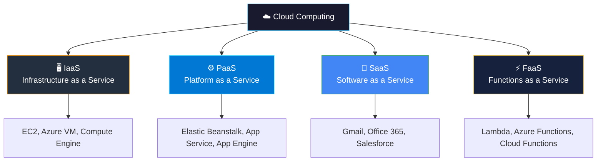
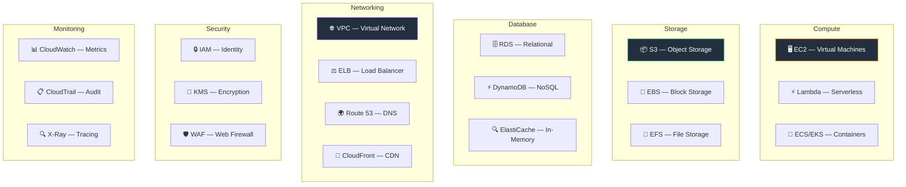
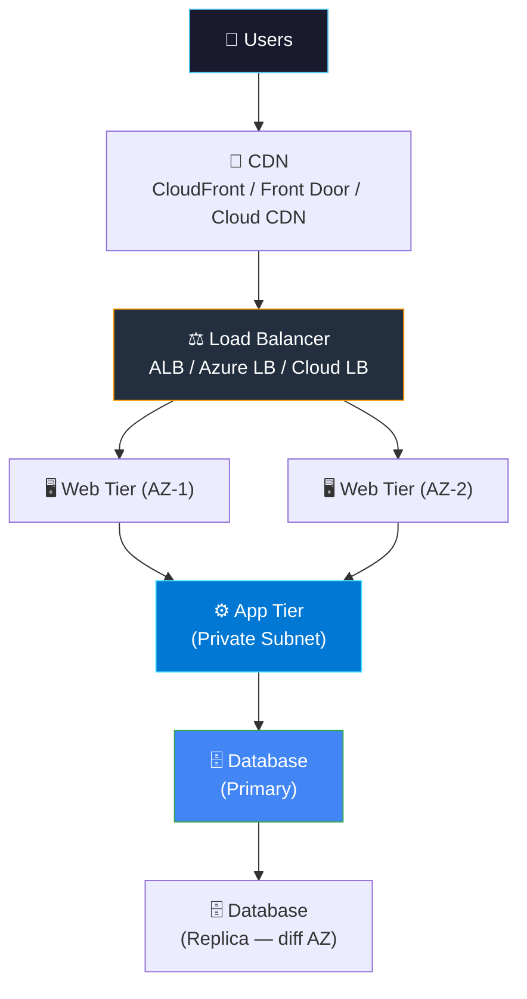
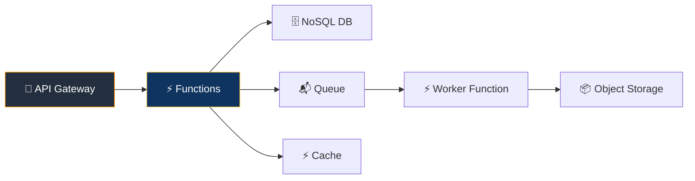

# ☁️ Cloud Engineering

> **Cloud is the foundation of modern infrastructure. This section covers the essential services, architecture patterns, and best practices for AWS, Azure, and GCP.**

<p align="center">
  
  
  
</p>

---

## 📋 Table of Contents

- [Cloud Service Models](#-cloud-service-models)
- [AWS Essentials](#-aws-essentials)
- [Azure Essentials](#-azure-essentials)
- [GCP Essentials](#-gcp-essentials)
- [Multi-Cloud Comparison](#-multi-cloud-comparison)
- [Cloud Architecture Patterns](#-cloud-architecture-patterns)
- [Cost Optimization](#-cost-optimization)
- [Further Reading](#-further-reading)

---

## 📖 Cloud Service Models



| You Manage | IaaS | PaaS | FaaS | SaaS |
|-----------|:----:|:----:|:----:|:----:|
| Application | ✅ | ✅ | ✅ | ❌ |
| Data | ✅ | ✅ | ✅ | ❌ |
| Runtime | ✅ | ❌ | ❌ | ❌ |
| OS | ✅ | ❌ | ❌ | ❌ |
| Networking | ✅ | ❌ | ❌ | ❌ |
| Storage | ✅ | ❌ | ❌ | ❌ |
| Servers | ❌ | ❌ | ❌ | ❌ |

---

## 🟠 AWS Essentials

### Core Services Map



### AWS Well-Architected Framework

| Pillar | Key Principle | Example |
|--------|--------------|---------|
| 🔒 **Security** | Least privilege, encrypt everything | IAM roles, KMS encryption, Security Groups |
| ⚡ **Performance** | Right-size resources, use caching | EC2 instance types, ElastiCache, CloudFront |
| 💰 **Cost Optimization** | Pay for what you use, spot instances | Reserved Instances, S3 lifecycle policies |
| 🔧 **Operational Excellence** | Automate, monitor, improve | CloudFormation, CloudWatch, Systems Manager |
| 🏗️ **Reliability** | Multi-AZ, auto-scaling, backups | RDS Multi-AZ, ASG, S3 cross-region replication |
| 🌿 **Sustainability** | Efficient resource usage | Graviton instances, right-sizing |

### Key AWS CLI Commands

```bash
# Identity
aws sts get-caller-identity                      # Who am I?
aws iam list-users                                # List IAM users

# EC2
aws ec2 describe-instances --output table         # List instances
aws ec2 start-instances --instance-ids i-xxxx     # Start instance
aws ec2 stop-instances --instance-ids i-xxxx      # Stop instance

# S3
aws s3 ls                                         # List buckets
aws s3 cp file.txt s3://my-bucket/                # Upload file
aws s3 sync ./dir s3://my-bucket/dir              # Sync directory

# EKS
aws eks list-clusters                             # List K8s clusters
aws eks update-kubeconfig --name my-cluster       # Configure kubectl

# CloudWatch
aws cloudwatch get-metric-statistics \
  --namespace AWS/EC2 \
  --metric-name CPUUtilization \
  --period 300 --statistics Average \
  --start-time 2025-01-01T00:00:00Z \
  --end-time 2025-01-02T00:00:00Z
```

---

## 🔵 Azure Essentials

### Core Services Map

| Category | Service | Equivalent (AWS) |
|----------|---------|------------------|
| **Compute** | Virtual Machines | EC2 |
| **Compute** | Azure Functions | Lambda |
| **Compute** | AKS (Kubernetes) | EKS |
| **Compute** | App Service | Elastic Beanstalk |
| **Storage** | Blob Storage | S3 |
| **Storage** | Azure Files | EFS |
| **Database** | Azure SQL | RDS |
| **Database** | Cosmos DB | DynamoDB |
| **Networking** | Virtual Network (VNet) | VPC |
| **Networking** | Azure Load Balancer | ELB |
| **Networking** | Azure DNS | Route 53 |
| **Networking** | Azure CDN / Front Door | CloudFront |
| **Security** | Azure AD / Entra ID | IAM |
| **Security** | Key Vault | KMS / Secrets Manager |
| **Monitoring** | Azure Monitor | CloudWatch |
| **Monitoring** | Log Analytics | CloudWatch Logs |
| **DevOps** | Azure DevOps | CodePipeline + CodeBuild |

### Key Azure CLI Commands

```bash
# Login & account
az login                                          # Login
az account show                                   # Current subscription
az account list --output table                    # List subscriptions

# Resource groups
az group list --output table                      # List resource groups
az group create --name myRG --location eastus     # Create RG

# VMs
az vm list --output table                         # List VMs
az vm create --resource-group myRG --name myVM \
  --image Ubuntu2204 --admin-username azureuser \
  --generate-ssh-keys                             # Create VM

# AKS
az aks list --output table                        # List clusters
az aks get-credentials --resource-group myRG \
  --name myCluster                                # Configure kubectl

# Storage
az storage account list --output table            # List accounts
az storage blob upload --account-name mystore \
  --container-name mycontainer --name file.txt \
  --file ./file.txt                               # Upload blob
```

---

## 🟢 GCP Essentials

### Core Services Map

| Category | Service | Equivalent (AWS) |
|----------|---------|------------------|
| **Compute** | Compute Engine | EC2 |
| **Compute** | Cloud Functions | Lambda |
| **Compute** | GKE (Kubernetes) | EKS |
| **Compute** | Cloud Run | Fargate |
| **Compute** | App Engine | Elastic Beanstalk |
| **Storage** | Cloud Storage | S3 |
| **Database** | Cloud SQL | RDS |
| **Database** | Firestore | DynamoDB |
| **Database** | BigQuery | Athena + Redshift |
| **Networking** | VPC | VPC |
| **Networking** | Cloud Load Balancing | ELB |
| **Networking** | Cloud DNS | Route 53 |
| **Networking** | Cloud CDN | CloudFront |
| **Security** | IAM | IAM |
| **Security** | Secret Manager | Secrets Manager |
| **Monitoring** | Cloud Monitoring | CloudWatch |
| **DevOps** | Cloud Build | CodeBuild |
| **AI/ML** | Vertex AI | SageMaker |

### Key gcloud CLI Commands

```bash
# Auth & project
gcloud auth login                                 # Login
gcloud config set project my-project              # Set project
gcloud projects list                              # List projects

# Compute
gcloud compute instances list                     # List VMs
gcloud compute instances create my-vm \
  --zone=us-central1-a --machine-type=e2-medium \
  --image-family=ubuntu-2204-lts \
  --image-project=ubuntu-os-cloud                 # Create VM

# GKE
gcloud container clusters list                    # List clusters
gcloud container clusters get-credentials my-cluster \
  --zone us-central1-a                            # Configure kubectl

# Cloud Storage
gsutil ls                                         # List buckets
gsutil cp file.txt gs://my-bucket/                # Upload
gsutil rsync -r ./dir gs://my-bucket/dir          # Sync

# Cloud Run (serverless containers)
gcloud run deploy my-service \
  --image gcr.io/my-project/my-app:latest \
  --region us-central1 --allow-unauthenticated    # Deploy
```

---

## 🔄 Multi-Cloud Comparison

### Service Mapping Cheatsheet

| Category | AWS | Azure | GCP |
|----------|-----|-------|-----|
| **VM** | EC2 | Virtual Machines | Compute Engine |
| **Serverless** | Lambda | Functions | Cloud Functions |
| **K8s** | EKS | AKS | GKE |
| **Serverless Containers** | Fargate | Container Apps | Cloud Run |
| **Object Storage** | S3 | Blob Storage | Cloud Storage |
| **SQL Database** | RDS | Azure SQL | Cloud SQL |
| **NoSQL** | DynamoDB | Cosmos DB | Firestore |
| **Cache** | ElastiCache | Cache for Redis | Memorystore |
| **DNS** | Route 53 | Azure DNS | Cloud DNS |
| **CDN** | CloudFront | Front Door | Cloud CDN |
| **Load Balancer** | ALB/NLB | Load Balancer | Cloud LB |
| **VPN** | Site-to-Site VPN | VPN Gateway | Cloud VPN |
| **IAM** | IAM | Entra ID | IAM |
| **Secrets** | Secrets Manager | Key Vault | Secret Manager |
| **Monitoring** | CloudWatch | Monitor | Cloud Monitoring |
| **Logging** | CloudWatch Logs | Log Analytics | Cloud Logging |
| **IaC** | CloudFormation | ARM/Bicep | Deployment Manager |
| **CI/CD** | CodePipeline | Azure DevOps | Cloud Build |
| **Container Registry** | ECR | ACR | GCR / Artifact Registry |
| **Data Warehouse** | Redshift | Synapse | BigQuery |

---

## 🏗️ Cloud Architecture Patterns

### 1. Three-Tier Architecture



### 2. Serverless Architecture



### 3. Multi-Region / Disaster Recovery

| Strategy | RPO | RTO | Cost |
|----------|-----|-----|------|
| **Backup & Restore** | Hours | Hours | $ |
| **Pilot Light** | Minutes | 10-30 min | $$ |
| **Warm Standby** | Seconds | Minutes | $$$ |
| **Active-Active** | Zero | Zero | $$$$ |

---

## 💰 Cost Optimization

### Top Cost Savings Strategies

| Strategy | Savings | Effort |
|----------|:-------:|:------:|
| **Right-sizing** — Match instance to actual usage | 20-40% | Low |
| **Reserved/Savings Plans** — 1-3 year commitment | 30-60% | Low |
| **Spot/Preemptible** — Use for fault-tolerant workloads | 60-90% | Medium |
| **Auto-scaling** — Scale down during off-hours | 20-30% | Medium |
| **Storage lifecycle** — Move old data to cold storage | 30-50% | Low |
| **Delete unused resources** — Unattached EBS, idle LBs | 10-20% | Low |
| **Containerization** — Higher density per instance | 20-40% | High |

### Cost Monitoring Commands

```bash
# AWS — Cost Explorer
aws ce get-cost-and-usage \
  --time-period Start=2025-01-01,End=2025-01-31 \
  --granularity MONTHLY --metrics "BlendedCost"

# Azure — Cost Analysis
az consumption usage list --start-date 2025-01-01 --end-date 2025-01-31

# GCP — Billing
gcloud billing accounts list
gcloud billing budgets list --billing-account=ACCOUNT_ID
```

---

## ⚠️ Common Pitfalls

| # | Pitfall | How to Avoid |
|---|---------|-------------|
| 1 | **Over-provisioning** | Use auto-scaling, right-size regularly |
| 2 | **No tagging strategy** | Tag everything: team, env, project, cost-center |
| 3 | **Public S3/Storage buckets** | Block public access by default |
| 4 | **Root account usage** | Never use root; create IAM users with MFA |
| 5 | **No budget alerts** | Set billing alerts at 50%, 80%, 100% |
| 6 | **Single region** | Use multi-AZ at minimum for production |
| 7 | **No IaC** | Never click in console; use Terraform/CloudFormation |
| 8 | **Hardcoded credentials** | Use IAM roles, service accounts, managed identity |

---

## 📚 Further Reading

| Resource | Type | Cloud |
|----------|------|:-----:|
| [AWS Well-Architected](https://aws.amazon.com/architecture/well-architected/) | 📖 Framework | AWS |
| [Azure Architecture Center](https://learn.microsoft.com/en-us/azure/architecture/) | 📖 Framework | Azure |
| [GCP Architecture Framework](https://cloud.google.com/architecture/framework) | 📖 Framework | GCP |
| [AWS Free Tier](https://aws.amazon.com/free/) | 🔧 Practice | AWS |
| [Azure Free Account](https://azure.microsoft.com/free/) | 🔧 Practice | Azure |
| [GCP Free Tier](https://cloud.google.com/free) | 🔧 Practice | GCP |
| [Cloud Comparison Tool](https://comparecloud.in/) | 🔧 Tool | All |

---

<p align="center">
  <a href="../README.md">⬅️ DevOps Home</a> · <a href="../07-infrastructure-as-code/README.md">Next: IaC ➡️</a>
</p>
