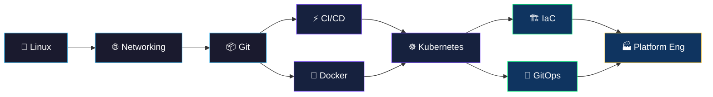

# 🔧 DevOps — Build & Ship

> **DevOps is a set of practices, tools, and cultural philosophies that automate and integrate the processes between software development and IT operations.**

---

## 🗺️ Learning Path

---

## 📚 Modules

| # | Module | Description | Difficulty | Status |
|---|--------|-------------|------------|--------|
| 01 | [**Linux Fundamentals**](./01-linux-fundamentals/) | Shell, file systems, processes | 🟢 Beginner | ✅ |
| 02 | [**Networking Basics**](./02-networking-basics/) | TCP/IP, DNS, load balancing | 🟢 Beginner | ✅ |
| 03 | [**Git & Version Control**](./03-git-version-control/) | Branching, rebasing, monorepos | 🟢 Beginner | ✅ |
| 04 | [**CI/CD Pipelines**](./04-ci-cd-pipelines/) | GitHub Actions, Jenkins, GitLab CI | 🟡 Intermediate | ✅ |
| 05 | [**Containerization**](./05-containerization/) | Docker, multi-stage builds, Compose | 🟡 Intermediate | ✅ |
| 06 | [**Container Orchestration**](./06-container-orchestration/) | Kubernetes, Helm, service mesh | 🔴 Advanced | ✅ |
| 07 | [**Infrastructure as Code**](./07-infrastructure-as-code/) | Terraform, Pulumi, state mgmt | 🟡 Intermediate | ✅ |
| 08 | [**GitOps**](./08-gitops/) | ArgoCD, FluxCD, progressive delivery | 🔴 Advanced | ✅ |
| 09 | [**Platform Engineering**](./09-platform-engineering/) | IDPs, Backstage, golden paths | 🔴 Advanced | ✅ |

---

## 💡 Key Principles

| Principle | Description |
|-----------|-------------|
| 🔄 **Continuous Integration** | Merge code frequently, test automatically |
| 🚀 **Continuous Delivery** | Always be ready to deploy to production |
| 🏗️ **Infrastructure as Code** | Treat infrastructure like application code |
| 📊 **Measure Everything** | You can't improve what you can't measure |
| 🤝 **Shared Responsibility** | Dev and Ops are one team |
| 🛡️ **Shift Left** | Find problems early in the pipeline |

---

## 📖 Recommended Books

- 📘 *The Phoenix Project* — Gene Kim
- 📗 *The DevOps Handbook* — Gene Kim, Jez Humble
- 📙 *Accelerate* — Nicole Forsgren, Jez Humble, Gene Kim

---

  <a href="../README.md">⬅️ Back to Main</a> · <a href="../02-sre/README.md">Next: SRE ➡️</a>

