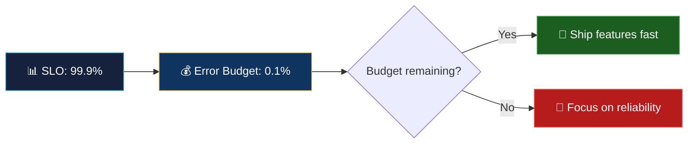

# 📘 SRE Fundamentals

> **"Hope is not a strategy." — Google SRE motto**

<p align="center">
  
  
</p>

---

## 📖 Conceptual Overview

Site Reliability Engineering was created at Google in 2003 when Ben Treynor was asked to run a production team. His answer: **"What happens when you ask a software engineer to design an operations function?"**

### SRE vs DevOps vs Traditional Ops

| Aspect | Traditional Ops | DevOps | SRE |
|--------|:--------------:|:------:|:---:|
| **Focus** | Stability | Velocity + Stability | Reliability as a feature |
| **Approach** | Manual runbooks | Automation culture | Engineering approach to ops |
| **Change** | Resist it | Embrace it | Manage it with error budgets |
| **On-call** | Ops team only | Shared responsibility | Developers carry pagers |
| **Hiring** | Sysadmins | DevOps engineers | Software engineers (50% coding) |

### The SRE Equation

```
SRE = Software Engineering + Systems Engineering + Production Ownership
```

Google mandates that SREs spend:
- **≤ 50%** on operations work (toil)
- **≥ 50%** on engineering (automation, tooling, reliability improvements)

---

## 🔑 Key Concepts

### Error Budgets — The Core Innovation



**Error budget = 100% − SLO target**

| SLO Target | Error Budget | Downtime Allowed/Month | Downtime Allowed/Year |
|:----------:|:----------:|:---------------------:|:--------------------:|
| 99% | 1% | 7h 18m | 3d 15h |
| 99.9% | 0.1% | 43m 50s | 8h 46m |
| 99.95% | 0.05% | 21m 55s | 4h 23m |
| 99.99% | 0.01% | 4m 23s | 52m 36s |
| 99.999% | 0.001% | 26s | 5m 16s |

> 💡 **Pro Tip:** Going from 99.9% to 99.99% is **10x harder and more expensive**. Choose your target wisely based on user expectations and business value.

### Toil — The Enemy of SRE

**Toil** = manual, repetitive, automatable, tactical work that scales linearly with service growth.

| Is Toil | Not Toil |
|---------|----------|
| Manually restarting services | Writing code to auto-restart |
| Running the same script every Monday | Writing a cron job |
| Manually scaling during traffic spikes | Setting up auto-scaling |
| Copy-pasting configs for new services | Building templates/scaffolding |

### SRE Practices Summary

| Practice | Purpose | Key Metric |
|----------|---------|------------|
| **Error Budgets** | Balance velocity vs reliability | Budget remaining % |
| **SLOs/SLIs** | Define "good enough" reliability | SLI compliance |
| **Monitoring/Alerting** | Detect issues before users do | MTTD |
| **Incident Response** | Minimize user impact | MTTR |
| **Postmortems** | Learn from failures | Action items closed |
| **Capacity Planning** | Don't run out of resources | Headroom % |
| **Change Management** | Reduce change-related outages | Change failure rate |
| **Toil Reduction** | Free up engineering time | Toil % (target: <50%) |

---

## 🏢 Real-world Use Case

### SRE at Google — By the Numbers

- **5,000+ SREs** across the company
- Manage services serving **billions of users**
- **On-call rotation:** max 25% of time, compensated with time off
- **Postmortem culture:** ~250 postmortems/month, all shared company-wide
- **Error budget policy:** If budget exhausted, feature releases are frozen

### How LinkedIn Adopted SRE

- Transitioned from traditional ops to SRE in 2017
- Created **3 SRE tiers:** embedded (in product teams), platform (shared infrastructure), tools (internal tooling)
- Key metric: reduced major incidents by **60%** in first year

---

## ⚠️ Common Pitfalls

| # | Pitfall | How to Avoid |
|---|---------|-------------|
| 1 | Renaming Ops to SRE without changing practices | SRE requires engineering culture and 50% coding time |
| 2 | Setting SLOs at 100% | 100% is impossible and stifles innovation |
| 3 | No executive buy-in for error budgets | Error budgets need teeth — freeze features when exhausted |
| 4 | SRE team as a dumping ground | SREs aren't ops; they're engineers who improve reliability |
| 5 | Not measuring toil | If you don't measure it, it'll consume all your time |

---

## 📚 Further Reading

| Resource | Type | Description |
|----------|------|-------------|
| [Google SRE Book](https://sre.google/sre-book/table-of-contents/) | 📘 Free Book | The original SRE bible |
| [SRE Workbook](https://sre.google/workbook/table-of-contents/) | 📘 Free Book | Practical companion |
| [SRE Weekly Newsletter](https://sreweekly.com/) | 📧 Newsletter | Weekly SRE news |
| [Google SRE Classroom](https://sre.google/classroom/) | 🎓 Course | Free Google SRE training |
| [Will Larson — An Elegant Puzzle](https://press.stripe.com/an-elegant-puzzle) | 📘 Book | Engineering management + SRE |

---

<p align="center">
  <a href="../README.md">⬅️ SRE Home</a> · <a href="../02-slos-slas-slis/README.md">Next: SLOs ➡️</a>
</p>
