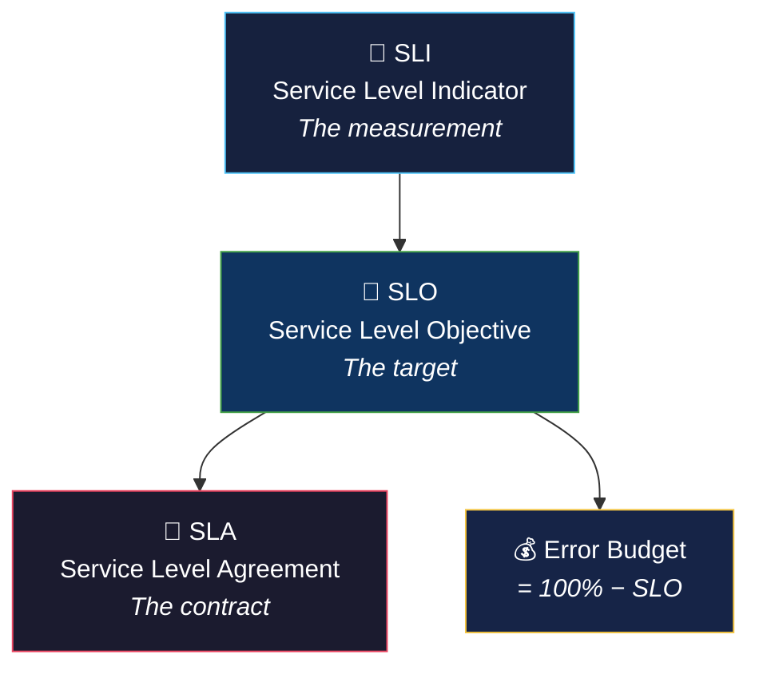

# 📊 SLOs, SLAs, and SLIs

> **If you can't measure it, you can't improve it. SLIs measure it, SLOs set the target, SLAs make it contractual.**

<p align="center">
  
  
  
</p>

---

## 📖 Conceptual Overview



| Concept | Definition | Example | Who Cares |
|---------|-----------|---------|-----------|
| **SLI** | A quantitative measure of service behavior | 95th percentile latency = 200ms | Engineers |
| **SLO** | The target value for an SLI | p95 latency < 300ms, 99.9% of the time | Engineering + Product |
| **SLA** | Contractual guarantee with consequences | 99.9% uptime or customer gets credits | Business + Legal |
| **Error Budget** | How much unreliability you can tolerate | 0.1% = 43 min downtime/month | Everyone |

> 💡 **Critical Rule:** SLO should be **stricter** than SLA. If your SLA promises 99.9%, your SLO should be 99.95%. This gives you a buffer.

---

## 🔑 Key Concepts

### Choosing the Right SLIs

| Service Type | Recommended SLIs |
|-------------|-----------------|
| **HTTP API** | Availability (% successful), Latency (p50, p95, p99), Error rate |
| **Data Pipeline** | Freshness (data age), Coverage (% records processed), Correctness |
| **Storage** | Durability (% data retained), Availability, Throughput |
| **Streaming** | Delivery rate, End-to-end latency, Message loss rate |

### SLO Best Practices

```
✅ DO:
  • Start with fewer SLOs (2-4 per service)
  • Use percentiles for latency (p95, p99), not averages
  • Review SLOs quarterly
  • Alert on error budget burn rate, not raw SLI

❌ DON'T:
  • Set SLO at 100% (impossible and blocks releases)
  • Use too many SLOs (creates noise)
  • Set SLOs without user journey data
  • Ignore your SLOs when they're breached
```

### Error Budget Burn Rate Alerting

Instead of alerting when SLO is breached, alert when the **burn rate** is too high:

| Window | Burn Rate | Meaning | Action |
|--------|:---------:|---------|--------|
| 1 hour | 14.4x | Budget gone in ~1.7 hours | 🔴 Page immediately |
| 6 hours | 6x | Budget gone in ~10 hours | 🟠 Page |
| 1 day | 3x | Budget gone in ~3.3 days | 🟡 Ticket |
| 3 days | 1x | On track to exhaust budget | 🔵 Review |

### SLO Calculator

```python
# Quick SLO math

slo = 99.9  # Your SLO target (%)
days_in_month = 30

# Error budget
error_budget_pct = 100 - slo  # 0.1%
allowed_downtime_minutes = days_in_month * 24 * 60 * (error_budget_pct / 100)
print(f"Allowed downtime: {allowed_downtime_minutes:.1f} minutes/month")  
# Output: 43.2 minutes/month

# Burn rate example
errors_in_last_hour = 150
total_requests_in_last_hour = 100000
current_error_rate = errors_in_last_hour / total_requests_in_last_hour  # 0.15%
burn_rate = current_error_rate / (error_budget_pct / 100)  # 1.5x
print(f"Current burn rate: {burn_rate:.1f}x")
# If burn_rate > 1, you're consuming budget faster than planned
```

---

## 🏢 Real-world Use Case

### Google Cloud's Public SLAs

Google publishes SLAs for every Cloud product:
- **Compute Engine:** 99.99% monthly uptime (multi-zone)
- **Cloud Storage:** 99.95% (Standard), 99.9% (Nearline)
- **Cloud SQL:** 99.95%

Financial consequences: 10-50% service credits when breached.

> 🔑 **Key Insight:** Google's internal SLOs are stricter than their public SLAs. The public SLA for GCE is 99.99%, but internal SLO might be 99.995%.

---

## ⚠️ Common Pitfalls

| # | Pitfall | How to Avoid |
|---|---------|-------------|
| 1 | Measuring SLI at the server, not the user | Measure from the user's perspective (client-side or load balancer) |
| 2 | Using averages for latency | Use percentiles — averages hide outliers |
| 3 | SLOs with no teeth | Define consequences: feature freeze, reliability sprint |
| 4 | Ignoring partial outages | A slow service is a broken service from user perspective |
| 5 | Not revisiting SLOs | Review quarterly as user expectations change |

---

## 📚 Further Reading

| Resource | Type | Description |
|----------|------|-------------|
| [Google SRE Book — Ch. 4](https://sre.google/sre-book/service-level-objectives/) | 📘 Free | SLOs at Google |
| [Implementing SLOs](https://www.oreilly.com/library/view/implementing-service-level/9781492076803/) | 📘 Book | Alex Hidalgo's comprehensive guide |
| [Sloth](https://github.com/slok/sloth) | 🔧 Tool | Generate Prometheus SLO rules |
| [OpenSLO](https://openslo.com/) | 📖 Spec | Vendor-neutral SLO specification |
| [Google SLO Workbook](https://sre.google/workbook/implementing-slos/) | 📘 Free | Practical SLO implementation |

---

<p align="center">
  <a href="../01-sre-fundamentals/README.md">⬅️ Previous: SRE Fundamentals</a> · <a href="../README.md">SRE Home</a> · <a href="../03-observability/README.md">Next: Observability ➡️</a>
</p>
