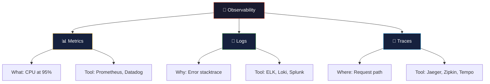

# 🔭 Observability

> **Observability is the ability to understand the internal state of a system by examining its external outputs — metrics, logs, and traces.**

<p align="center">
  
  
</p>

---

## 📋 Table of Contents

- [Conceptual Overview](#-conceptual-overview)
- [Key Concepts](#-key-concepts)
- [Hands-on Lab](#-hands-on-lab)
- [Real-world Use Case](#-real-world-use-case)
- [Common Pitfalls](#-common-pitfalls)
- [Further Reading](#-further-reading)

---

## 📖 Conceptual Overview

Observability answers: **"Why is my system broken?"** — not just "Is it broken?"

### Monitoring vs Observability

| Monitoring | Observability |
|-----------|---------------|
| Tells you **what** is broken | Tells you **why** it's broken |
| Pre-defined dashboards | Ad-hoc exploration |
| Known unknowns | Unknown unknowns |
| "CPU is at 95%" | "CPU is high because of a regex backtrack in the auth service caused by a specific user input pattern" |

### The Three Pillars



| Pillar | What It Tells You | Example | Key Tools |
|--------|-------------------|---------|-----------|
| **📊 Metrics** | Numeric measurements over time | Request rate, error rate, latency | Prometheus, Datadog, CloudWatch |
| **📝 Logs** | Detailed event records | Error messages, stack traces | ELK Stack, Loki, Splunk |
| **🔗 Traces** | Request journey across services | Which service is slow | Jaeger, Zipkin, Tempo |

> 💡 **Pro Tip:** Start with metrics (cheap, fast), add structured logs, then add tracing. Don't try to implement all three at once.

---

## 🔑 Key Concepts

### RED Method (for request-driven services)

| Metric | What It Measures | Alert When |
|--------|-----------------|------------|
| **R**ate | Requests per second | Sudden spike or drop |
| **E**rrors | Failed requests per second | Error rate > threshold |
| **D**uration | Response time (p50, p95, p99) | Latency exceeds SLO |

### USE Method (for resources: CPU, memory, disk)

| Metric | What It Measures | Alert When |
|--------|-----------------|------------|
| **U**tilization | % resource busy | > 80% sustained |
| **S**aturation | Queue depth / waiting | Any saturation |
| **E**rrors | Error events count | Any errors |

### Golden Signals (Google SRE)

| Signal | Description | Example |
|--------|-------------|---------|
| **Latency** | Time to serve a request | p99 latency > 500ms |
| **Traffic** | Demand on your system | Requests per second |
| **Errors** | Rate of failed requests | 5xx errors / total |
| **Saturation** | How "full" your service is | CPU, memory, queue depth |

---

## 🔧 Hands-on Lab

### Lab: Set Up Prometheus + Grafana Monitoring Stack

**Objective:** Deploy a complete monitoring stack and create dashboards.

#### Prerequisites
- Docker and Docker Compose installed
- Basic understanding of YAML

#### Step 1: Review Configurations

| File | Purpose |
|------|---------|
| [prometheus.yml](./prometheus/prometheus.yml) | Prometheus scrape configuration |
| [alert-rules.yml](./prometheus/alert-rules.yml) | Alerting rules for common scenarios |

#### Step 2: Start the Stack

```bash
# Create a docker-compose.yml for the monitoring stack
# (or use the one from the containerization module)

docker compose up -d prometheus grafana

# Verify services are running
docker compose ps

# Access:
# Prometheus: http://localhost:9090
# Grafana:    http://localhost:3001 (admin/admin)
```

#### Step 3: Explore Prometheus

```bash
# Open http://localhost:9090 and try these PromQL queries:

# 1. Current CPU usage
rate(process_cpu_seconds_total[5m])

# 2. Memory usage in MB
process_resident_memory_bytes / 1024 / 1024

# 3. HTTP request rate
rate(http_requests_total[5m])

# 4. 95th percentile latency
histogram_quantile(0.95, rate(http_request_duration_seconds_bucket[5m]))

# 5. Error rate percentage
rate(http_requests_total{status=~"5.."}[5m]) / rate(http_requests_total[5m]) * 100
```

#### Step 4: Create Grafana Dashboard

1. Open Grafana at `http://localhost:3001`
2. Add Prometheus as a data source (`http://prometheus:9090`)
3. Import dashboard ID `1860` (Node Exporter) or create custom panels

#### Cleanup

```bash
docker compose down -v
```

---

## 🏢 Real-world Use Case

### How Google Does Observability

Google's internal monitoring system, **Monarch**, handles:
- **Trillions** of data points per day
- **Petabytes** of metrics data
- Sub-second query latency across the entire fleet

**Key practices:**
1. **Structured events over unstructured logs** — Every log line is a structured event with correlation IDs
2. **Exemplars** — Link metrics to specific trace IDs for instant drill-down
3. **SLO-based alerting** — Alert on error budget burn rate, not raw metrics
4. **4 Golden Signals** — Every service dashboard starts with latency, traffic, errors, saturation

### How Uber Monitors 4,000+ Microservices

Uber's observability stack:
- **M3** — Custom metrics platform handling billions of metrics/sec
- **Jaeger** — Distributed tracing (which they created and open-sourced)
- Custom alerting that considers **seasonality** (weekend vs weekday patterns)

---

## ⚠️ Common Pitfalls

| # | Pitfall | Why It Happens | How to Avoid |
|---|---------|---------------|--------------|
| 1 | **Dashboard overload** | Creating dashboards for everything | Focus on the 4 Golden Signals per service |
| 2 | **Alert fatigue** | Too many noisy alerts | Alert on symptoms (user impact), not causes |
| 3 | **Missing context** | Metrics without labels | Add meaningful labels: service, environment, version |
| 4 | **High cardinality** | Using user IDs as metric labels | Never use unbounded values as labels |
| 5 | **No correlation** | Metrics, logs, traces are siloed | Use correlation IDs across all three pillars |
| 6 | **Monitoring the monitor** | Prometheus goes down, nobody knows | Use dead man's switch / watchdog alerts |
| 7 | **No runbooks linked** | Alert fires, nobody knows what to do | Every alert should link to a runbook |

---

## 📚 Further Reading

| Resource | Type | Description |
|----------|------|-------------|
| [Prometheus Docs](https://prometheus.io/docs/) | 📖 Docs | Official documentation |
| [Grafana Docs](https://grafana.com/docs/) | 📖 Docs | Dashboard and visualization |
| [OpenTelemetry](https://opentelemetry.io/) | 🔧 Tool | Vendor-neutral observability framework |
| [Observability Engineering](https://www.oreilly.com/library/view/observability-engineering/9781492076438/) | 📘 Book | Charity Majors' comprehensive guide |
| [Google SRE Book — Ch. 6](https://sre.google/sre-book/monitoring-distributed-systems/) | 📖 Free | Monitoring distributed systems |
| [USE Method](https://www.brendangregg.com/usemethod.html) | 📖 Article | Brendan Gregg's resource methodology |

---

<p align="center">
  <a href="../README.md">⬅️ SRE Home</a> · <a href="../04-incident-management/README.md">Next: Incident Management ➡️</a>
</p>
