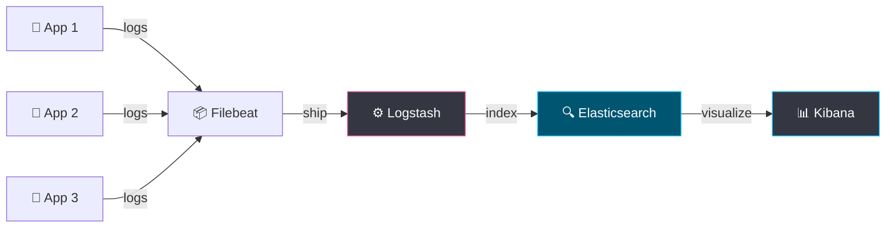

# 📝 ELK Stack — Log Aggregation

> **Elasticsearch + Logstash + Kibana — the industry-standard log aggregation and search platform.**

---

## Architecture



| Component | Role |
|-----------|------|
| **Filebeat** | Lightweight log shipper (runs on each node) |
| **Logstash** | Log processing pipeline (parse, transform, enrich) |
| **Elasticsearch** | Full-text search and analytics engine |
| **Kibana** | Visualization and dashboards |

---

## Quick Start (Docker Compose)

```yaml
# docker-compose-elk.yml
version: '3.8'
services:
  elasticsearch:
    image: docker.elastic.co/elasticsearch/elasticsearch:8.12.0
    environment:
      - discovery.type=single-node
      - xpack.security.enabled=false
      - "ES_JAVA_OPTS=-Xms512m -Xmx512m"
    ports: ["9200:9200"]
    volumes: ["es-data:/usr/share/elasticsearch/data"]

  logstash:
    image: docker.elastic.co/logstash/logstash:8.12.0
    volumes:
      - ./logstash/pipeline:/usr/share/logstash/pipeline
    ports: ["5044:5044"]
    depends_on: [elasticsearch]

  kibana:
    image: docker.elastic.co/kibana/kibana:8.12.0
    environment:
      ELASTICSEARCH_HOSTS: http://elasticsearch:9200
    ports: ["5601:5601"]
    depends_on: [elasticsearch]

volumes:
  es-data:
```

```bash
docker compose -f docker-compose-elk.yml up -d
# Kibana: http://localhost:5601
# Elasticsearch: http://localhost:9200
```

## Logstash Pipeline Config

```ruby
# logstash/pipeline/logstash.conf
input {
  beats { port => 5044 }
}

filter {
  # Parse JSON logs
  json { source => "message" }

  # Parse timestamps
  date {
    match => ["timestamp", "ISO8601"]
    target => "@timestamp"
  }

  # Add geo-IP for IP fields
  geoip { source => "client_ip" }

  # Drop debug logs in production
  if [level] == "DEBUG" { drop {} }
}

output {
  elasticsearch {
    hosts => ["elasticsearch:9200"]
    index => "app-logs-%{+YYYY.MM.dd}"
  }
}
```

---

## ELK vs Alternatives

| Feature | ELK Stack | Grafana Loki | Splunk |
|---------|-----------|-------------|--------|
| **Cost** | Free (self-hosted) | Free (self-hosted) | $$$$ |
| **Storage** | Indexes everything | Indexes labels only | Indexes everything |
| **Query** | Lucene/KQL | LogQL | SPL |
| **Best for** | Full-text search | K8s-native, Grafana users | Enterprise, compliance |
| **Scaling** | Complex | Simple | Managed |

> 💡 **Recommendation:** Use **Loki** if you already use Grafana. Use **ELK** if you need powerful full-text search. Use **Splunk** if your company pays for it.

---

## Further Reading

- [Elastic Docs](https://www.elastic.co/guide/index.html)
- [Grafana Loki](https://grafana.com/oss/loki/)
- [Fluentd](https://www.fluentd.org/) — Alternative to Logstash (CNCF)
