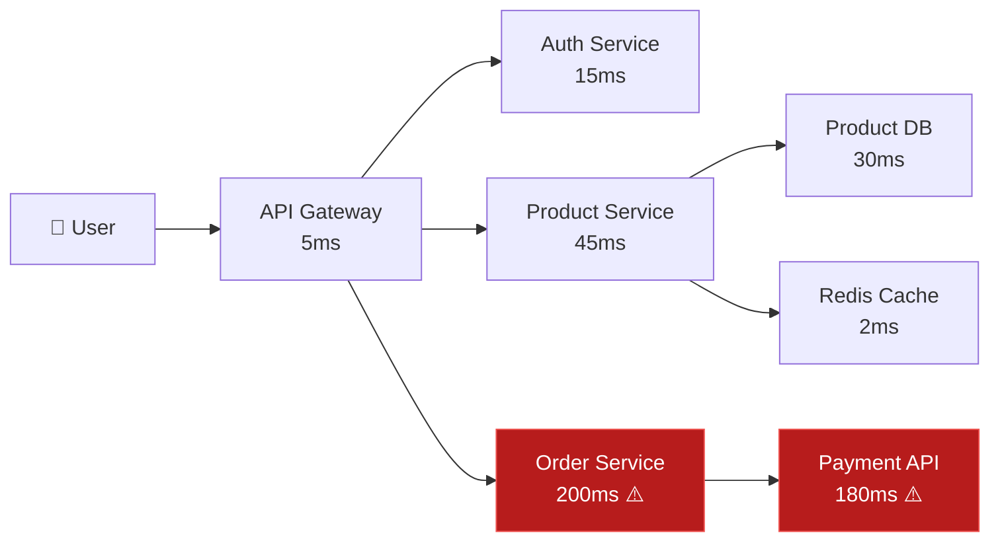

# 🔍 Distributed Tracing with Jaeger

> **Distributed tracing follows a single request as it travels through multiple microservices, showing you exactly where time is spent.**

---

## Why Distributed Tracing?



Without tracing, you see: *"The request took 300ms."*
With tracing, you see: *"200ms of the 300ms was spent in the Payment API call from the Order Service."*

---

## Key Concepts

| Concept | Description |
|---------|-------------|
| **Span** | A single operation (e.g., HTTP request, DB query). Has start time, duration, status |
| **Trace** | A tree of spans — the full journey of one request |
| **Context Propagation** | Passing trace IDs via HTTP headers (`traceparent`) across service boundaries |
| **Sampling** | Collecting only a percentage of traces (100% is too expensive at scale) |
| **Baggage** | Key-value pairs that propagate with the trace (user ID, tenant, region) |

---

## Hands-on: Deploy Jaeger

```bash
# Option 1: Docker (all-in-one)
docker run -d --name jaeger \
  -p 16686:16686 \
  -p 4317:4317 \
  -p 4318:4318 \
  jaegertracing/all-in-one:latest

# Access Jaeger UI: http://localhost:16686

# Option 2: Kubernetes
helm repo add jaegertracing https://jaegertracing.github.io/helm-charts
helm install jaeger jaegertracing/jaeger -n tracing --create-namespace
```

## Instrument Your App (Node.js)

```javascript
// tracing.js — Initialize BEFORE importing any other modules
const { NodeSDK } = require('@opentelemetry/sdk-node');
const { OTLPTraceExporter } = require('@opentelemetry/exporter-trace-otlp-http');
const { getNodeAutoInstrumentations } = require('@opentelemetry/auto-instrumentations-node');

const sdk = new NodeSDK({
  traceExporter: new OTLPTraceExporter({
    url: 'http://localhost:4318/v1/traces',
  }),
  instrumentations: [getNodeAutoInstrumentations()],
  serviceName: 'my-api-service',
});
sdk.start();
```

```bash
# Run with tracing
node -r ./tracing.js app.js

# Generate some requests, then check Jaeger UI at http://localhost:16686
```

---

## Sampling Strategies

| Strategy | Description | Use When |
|----------|-------------|----------|
| **Always On** | Trace every request | Dev/staging only |
| **Probabilistic** | Trace X% of requests | Production (1-10%) |
| **Rate Limiting** | N traces per second | High-traffic services |
| **Tail-based** | Decide after span completes | Capture errors/slow requests |

---

## Further Reading

- [Jaeger Docs](https://www.jaegertracing.io/docs/)
- [OpenTelemetry Tracing](https://opentelemetry.io/docs/concepts/signals/traces/)
- [Grafana Tempo](https://grafana.com/oss/tempo/) — Jaeger alternative
