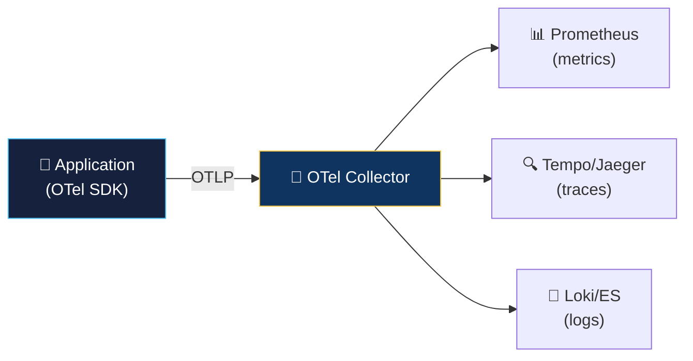

# 🔭 OpenTelemetry (OTel)

> **OpenTelemetry is the CNCF standard for generating, collecting, and exporting telemetry data (traces, metrics, logs).**

---

## Why OpenTelemetry?

| Before OTel | After OTel |
|-------------|-----------|
| Vendor-specific SDKs (Datadog, New Relic, Jaeger) | One standard SDK for all |
| Locked into one vendor | Switch backends without code changes |
| Separate APIs for traces, metrics, logs | Unified API for all signals |
| Inconsistent instrumentation | Standardized semantic conventions |

## Architecture



## Quick Start — Auto-Instrumentation

```bash
# Node.js — zero-code instrumentation
npm install @opentelemetry/auto-instrumentations-node @opentelemetry/sdk-node @opentelemetry/exporter-trace-otlp-http

# Python
pip install opentelemetry-distro opentelemetry-exporter-otlp
opentelemetry-bootstrap -a install

# Java — agent-based (no code changes)
java -javaagent:opentelemetry-javaagent.jar -jar myapp.jar
```

## OTel Collector Config

```yaml
# otel-collector-config.yaml
receivers:
  otlp:
    protocols:
      grpc:
        endpoint: "0.0.0.0:4317"
      http:
        endpoint: "0.0.0.0:4318"

processors:
  batch:
    timeout: 5s
    send_batch_size: 1024

exporters:
  prometheus:
    endpoint: "0.0.0.0:8889"
  otlp:
    endpoint: "tempo:4317"
    tls:
      insecure: true

service:
  pipelines:
    traces:
      receivers: [otlp]
      processors: [batch]
      exporters: [otlp]
    metrics:
      receivers: [otlp]
      processors: [batch]
      exporters: [prometheus]
```

## Key Concepts

| Concept | Description |
|---------|-------------|
| **Span** | A unit of work (e.g., an HTTP request, a database query) |
| **Trace** | A tree of spans showing the full request path |
| **Context Propagation** | Passing trace IDs across service boundaries |
| **Semantic Conventions** | Standard attribute names (e.g., `http.method`, `db.system`) |
| **Collector** | Agent that receives, processes, and exports telemetry |
| **OTLP** | OpenTelemetry Protocol — the wire format |

## Further Reading

- [OpenTelemetry Docs](https://opentelemetry.io/docs/)
- [OTel Collector](https://opentelemetry.io/docs/collector/)
- [CNCF Landscape](https://landscape.cncf.io/) — OpenTelemetry is a CNCF Graduated project
