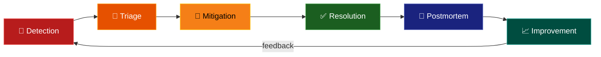

# 🚨 Incident Management

> **Incident management is the process of identifying, analyzing, and resolving incidents — unplanned interruptions or reductions in the quality of a service.**

<p align="center">
  
  
</p>

---

## 📋 Table of Contents

- [Conceptual Overview](#-conceptual-overview)
- [Key Concepts](#-key-concepts)
- [Hands-on Lab](#-hands-on-lab)
- [Real-world Use Case](#-real-world-use-case)
- [Common Pitfalls](#-common-pitfalls)
- [Further Reading](#-further-reading)

---

## 📖 Conceptual Overview

Every production system will eventually fail. What separates great teams from struggling ones isn't whether they have incidents — it's **how they handle them**.

### Incident Lifecycle



### Severity Levels

| Level | Name | Impact | Response Time | Example |
|:-----:|------|--------|:-------------:|---------|
| **SEV-1** | 🔴 Critical | Service down, data loss | < 15 min | Payment system down |
| **SEV-2** | 🟠 Major | Significant degradation | < 30 min | 50% of users affected |
| **SEV-3** | 🟡 Minor | Limited impact | < 4 hours | One feature broken |
| **SEV-4** | 🟢 Low | Minimal impact | Next business day | UI glitch |

---

## 🔑 Key Concepts

### Incident Roles

| Role | Responsibility | Who |
|------|---------------|-----|
| **Incident Commander (IC)** | Coordinates response, makes decisions | On-call lead |
| **Communications Lead** | Updates stakeholders, status page | Product/PM |
| **Operations Lead** | Hands-on debugging and mitigation | Senior engineer |
| **Scribe** | Documents timeline and actions | Any team member |

### MTTX Metrics

```
        Detection      Acknowledgement     Mitigation     Resolution
           │                │                  │              │
    ───────┼────────────────┼──────────────────┼──────────────┼──────
           │                │                  │              │
           │←── MTTD ──→│  │                  │              │
           │                │←── MTTA ──→│    │              │
           │                                   │←─── MTTR ──→│
           │←──────────────── MTTR (total) ───────────────→│
```

| Metric | Full Name | Target | How to Improve |
|--------|-----------|--------|----------------|
| **MTTD** | Mean Time to Detect | < 5 min | Better monitoring + alerting |
| **MTTA** | Mean Time to Acknowledge | < 15 min | Clear on-call processes |
| **MTTR** | Mean Time to Resolve | < 1 hour | Runbooks + automation |
| **MTBF** | Mean Time Between Failures | ↑ Maximize | Chaos engineering + testing |

---

## 🔧 Hands-on Lab

### Lab: Build Your Incident Management Kit

**Objective:** Create production-ready templates for handling incidents.

#### Templates Created

| Template | Purpose | File |
|----------|---------|------|
| 📋 Incident Report | Real-time incident tracking | [incident-template.md](./templates/incident-template.md) |
| 📝 Postmortem | Blameless root cause analysis | [postmortem-template.md](./templates/postmortem-template.md) |
| 🔧 High CPU Runbook | Step-by-step CPU troubleshooting | [high-cpu-runbook.md](./runbooks/high-cpu-runbook.md) |
| 🔧 DB Failover Runbook | Database failover procedure | [database-failover-runbook.md](./runbooks/database-failover-runbook.md) |

#### How to Use

1. **During an incident:** Copy the incident template and fill it out in real-time
2. **After resolution:** Schedule a postmortem within 48 hours using the template
3. **Runbooks:** Keep in a searchable wiki (Confluence, Notion, GitHub)

---

## 🏢 Real-world Use Case

### Google's Incident Management

Google's approach (from the SRE book):

1. **On-call structure:** Primary + Secondary on-call, max 25% of time on-call
2. **Incident declaration:** Anyone can declare an incident
3. **War rooms:** Virtual war rooms with all responders
4. **Blameless postmortems:** Mandatory for SEV-1 and SEV-2
5. **Error budgets:** If error budget is exhausted, feature work stops

> 🔑 **Key Quote:** *"Blamelessness is not about being nice. It's about being effective."*

### The GitLab Database Incident (2017)

A legendary incident that shaped how the industry thinks about postmortems:

- An engineer accidentally deleted a production database
- GitLab live-streamed the recovery on YouTube
- Their postmortem was **fully public** — radical transparency
- Result: Industry-wide improvements in backup verification

**Lessons learned:**
- Test your backups (GitLab's backups were silently failing)
- Have a recovery runbook that's actually tested
- Transparency builds trust, even during failures

---

## ⚠️ Common Pitfalls

| # | Pitfall | Why It Happens | How to Avoid |
|---|---------|---------------|--------------|
| 1 | **Blame culture** | Natural human tendency | Enforce blameless postmortems — focus on systems, not people |
| 2 | **No incident commander** | Everyone jumps in to help | Assign IC role immediately when incident starts |
| 3 | **Skipping postmortems** | "We're too busy" | Make them mandatory. No postmortem = no learning |
| 4 | **Postmortem but no action** | Items added but never done | Assign owners and deadlines to every action item |
| 5 | **Hero culture** | One person always saves the day | Cross-train team, document everything |
| 6 | **Alert → Incident** | Every alert triggers a response | Not every alert is an incident. Define clear thresholds |
| 7 | **No communication** | Heads-down debugging | Designate a comms lead, update status page |

---

## 📚 Further Reading

| Resource | Type | Description |
|----------|------|-------------|
| [Google SRE Book — Ch. 14](https://sre.google/sre-book/managing-incidents/) | 📖 Free | Managing incidents at Google |
| [PagerDuty Incident Response](https://response.pagerduty.com/) | 📖 Guide | Open-source incident response docs |
| [Incident.io Blog](https://incident.io/blog) | 📝 Blog | Practical incident management content |
| [Learning from Incidents](https://www.learningfromincidents.io/) | 📖 Research | Academic approach to incident learning |
| [Jeli Post-Incident Reviews](https://www.jeli.io/) | 🔧 Tool | Post-incident analysis platform |

---

<p align="center">
  <a href="../03-observability/README.md">⬅️ Previous: Observability</a> · <a href="../README.md">SRE Home</a>
</p>
