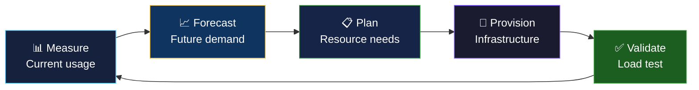

# 📈 Capacity Planning

> **Capacity planning ensures your infrastructure can handle current load and anticipated growth without over-provisioning (wasting money) or under-provisioning (causing outages).**

  
  

---

## 📖 Conceptual Overview

### The Capacity Planning Spectrum

| Under-provisioned | Right-sized | Over-provisioned |
|:-:|:-:|:-:|
| 💥 Outages during peaks | ✅ Handles load + headroom | 💸 Wasting money |
| Poor user experience | Good performance | Budget inefficiency |
| Reactive fire-fighting | Proactive planning | Capital sitting idle |

> 💡 **Pro Tip:** Target **30-40% headroom** above peak load. Less = risky, more = wasteful.

---

## 🔑 Key Concepts

### Load Testing

| Tool | Type | Best For |
|------|------|----------|
| **k6** | Script-based | Developer-friendly, CI/CD integration |
| **Locust** | Python-based | Custom user behavior simulation |
| **JMeter** | GUI + CLI | Traditional, comprehensive |
| **Gatling** | Scala-based | High-performance scenarios |
| **wrk / hey** | CLI | Quick HTTP benchmarking |

### Key Metrics to Track

| Resource | Metric | Warning | Critical |
|----------|--------|:-------:|:--------:|
| **CPU** | Utilization % | > 70% | > 85% |
| **Memory** | Usage % | > 80% | > 90% |
| **Disk** | Usage % | > 75% | > 90% |
| **Network** | Bandwidth % | > 60% | > 80% |
| **Database** | Connection pool % | > 70% | > 85% |

### Scaling Strategies

| Strategy | When to Use | Pros | Cons |
|----------|------------|------|------|
| **Vertical** (bigger machine) | Quick fix, databases | Simple | Hardware limits |
| **Horizontal** (more machines) | Stateless services | Near-infinite | Complexity |
| **Auto-scaling** | Variable traffic | Cost-efficient | Cold start latency |
| **Pre-scaling** | Known events (sale, launch) | Guaranteed capacity | Requires planning |

---

## 🏢 Real-world Use Case

### How Amazon Handles Prime Day

- **Traffic:** 100x normal on some services
- **Preparation:** Starts 6 months before
- **Load testing:** Simulate Prime Day traffic on production infrastructure
- **Pre-scaling:** Spin up capacity weeks in advance
- **Game days:** Practice failure scenarios at scale

---

## 📚 Further Reading

| Resource | Type | Description |
|----------|------|-------------|
| [Google SRE — Ch. 18](https://sre.google/sre-book/software-engineering-in-sre/) | 📘 Free | Capacity planning at Google |
| [k6 Docs](https://k6.io/docs/) | 🔧 Tool | Modern load testing |
| [Locust](https://locust.io/) | 🔧 Tool | Python load testing |
| [The Art of Capacity Planning](https://www.oreilly.com/library/view/the-art-of/9780596518578/) | 📘 Book | John Allspaw's guide |

---

  <a href="../05-chaos-engineering/README.md">⬅️ Previous: Chaos</a> · <a href="../README.md">SRE Home</a> · <a href="../07-toil-reduction/README.md">Next: Toil ➡️</a>

