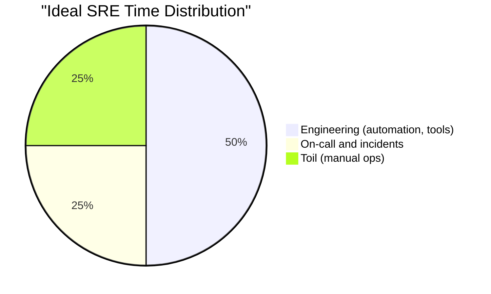
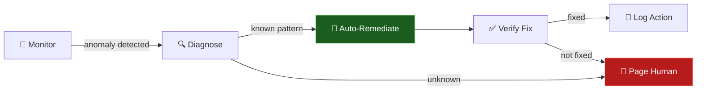

# 🤖 Toil Reduction

> **"If a human operator needs to touch your system during normal operations, you have a bug." — Carla Geisser, Google SRE**

  
  

---

## 📖 Conceptual Overview

**Toil** is work that is manual, repetitive, automatable, tactical, devoid of enduring value, and scales linearly with service growth.

### The Toil Test

Ask these questions about any operational task:

| Question | If Yes → Toil |
|----------|--------------|
| Is it **manual**? | A human runs a script or clicks buttons |
| Is it **repetitive**? | You've done it before and will do it again |
| Is it **automatable**? | A machine could do it |
| Is it **reactive**? | Triggered by an alert or request, not proactive |
| Does it **scale linearly**? | More services = more of this work |
| Does it have **no enduring value**? | Nothing is better after you do it |

---

## 🔑 Key Concepts

### Toil Budget

Google's rule: **SREs should spend ≤ 50% of their time on toil.** If toil exceeds 50%, the SRE team escalates to management.

### Automation ROI Framework

Before automating, ask: **Is it worth automating?**

| Frequency | Time Per Task | Annual Time | Automate? |
|-----------|:------------:|:-----------:|:---------:|
| Daily | 5 min | 21 hours | ✅ Yes |
| Weekly | 30 min | 26 hours | ✅ Yes |
| Monthly | 2 hours | 24 hours | ✅ Yes |
| Quarterly | 1 hour | 4 hours | 🤷 Maybe |
| Yearly | 4 hours | 4 hours | ❌ Probably not |

> 💡 **Pro Tip:** Don't just consider time saved. Consider: risk reduction, consistency, team morale, and knowledge capture.

### Self-Healing Systems

The ultimate toil eliminator — systems that fix themselves:

**Examples of self-healing:**
- K8s restarts crashed pods (liveness probes)
- Auto-scaling adds capacity during traffic spikes
- Circuit breakers disable unhealthy dependencies
- Automated certificate renewal (cert-manager)

---

## 🏢 Real-world Use Case

### How Google Reduced Toil in the Ads SRE Team

- **Problem:** SRE team spending 70% of time on toil (manual deployments, config changes, ticket triage)
- **Action:** Built automation for the top 5 toil-generating tasks
- **Result:** Toil reduced to 30%, freeing 40% of team capacity for engineering
- **Bonus:** Automated processes were more reliable than manual ones

---

## ⚠️ Common Pitfalls

| # | Pitfall | How to Avoid |
|---|---------|-------------|
| 1 | Automating before understanding | Document the manual process first |
| 2 | Over-engineering automation | Start simple; iterate based on ROI |
| 3 | Not tracking toil | Measure toil weekly; categorize and prioritize |
| 4 | Automating one-off tasks | Focus on recurring, high-frequency tasks |
| 5 | Automation without monitoring | Automated failures are invisible without monitoring |

---

## 📚 Further Reading

| Resource | Type | Description |
|----------|------|-------------|
| [Google SRE — Ch. 5](https://sre.google/sre-book/eliminating-toil/) | 📘 Free | Eliminating toil at Google |
| [Toil Taxonomy](https://sre.google/workbook/eliminating-toil/) | 📘 Free | Categorizing and measuring toil |
| [Rundeck](https://www.rundeck.com/) | 🔧 Tool | Operations automation platform |
| [StackStorm](https://stackstorm.com/) | 🔧 Tool | Event-driven automation (open source) |

---

  <a href="../06-capacity-planning/README.md">⬅️ Previous: Capacity</a> · <a href="../README.md">SRE Home</a>

