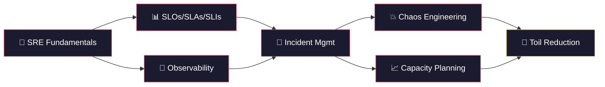

# 🔥 SRE — Run & Reliability

> **Site Reliability Engineering is a discipline that incorporates aspects of software engineering and applies them to infrastructure and operations problems. — Ben Treynor, VP Engineering at Google**

---

## 🗺️ Learning Path

---

## 📚 Modules

| # | Module | Description | Difficulty | Status |
|---|--------|-------------|------------|--------|
| 01 | [**SRE Fundamentals**](./01-sre-fundamentals/) | Philosophy, error budgets, risk | 🟢 Beginner | ✅ |
| 02 | [**SLOs / SLAs / SLIs**](./02-slos-slas-slis/) | Defining and measuring service levels | 🟡 Intermediate | ✅ |
| 03 | [**Observability**](./03-observability/) | Metrics, logs, traces — the three pillars | 🟡 Intermediate | ✅ |
| 04 | [**Incident Management**](./04-incident-management/) | On-call, runbooks, postmortems | 🟡 Intermediate | ✅ |
| 05 | [**Chaos Engineering**](./05-chaos-engineering/) | Litmus, Chaos Monkey, game days | 🔴 Advanced | ✅ |
| 06 | [**Capacity Planning**](./06-capacity-planning/) | Load testing, forecasting, scaling | 🔴 Advanced | ✅ |
| 07 | [**Toil Reduction**](./07-toil-reduction/) | Automation, self-healing systems | 🟡 Intermediate | ✅ |

---

## 💡 Core SRE Principles

| Principle | Description |
|-----------|-------------|
| 🎯 **Error Budgets** | The acceptable amount of unreliability — spend it on velocity |
| 📊 **SLOs over SLAs** | Internal targets should be stricter than contractual promises |
| 🔭 **Observability** | You can't fix what you can't see |
| 📝 **Blameless Postmortems** | Learn from failures, don't punish people |
| 🤖 **Eliminate Toil** | If a human does it more than twice, automate it |
| 💥 **Embrace Risk** | 100% reliability is the wrong target |

---

## 📖 Recommended Books

- 📘 *Site Reliability Engineering* — Google (The SRE Book)
- 📗 *The Site Reliability Workbook* — Google (Practical companion)
- 📙 *Seeking SRE* — David Blank-Edelman
- 📕 *Implementing Service Level Objectives* — Alex Hidalgo

---

  <a href="../01-devops/README.md">⬅️ Previous: DevOps</a> · <a href="../README.md">Home</a> · <a href="../03-aiops/README.md">Next: AIOps ➡️</a>

