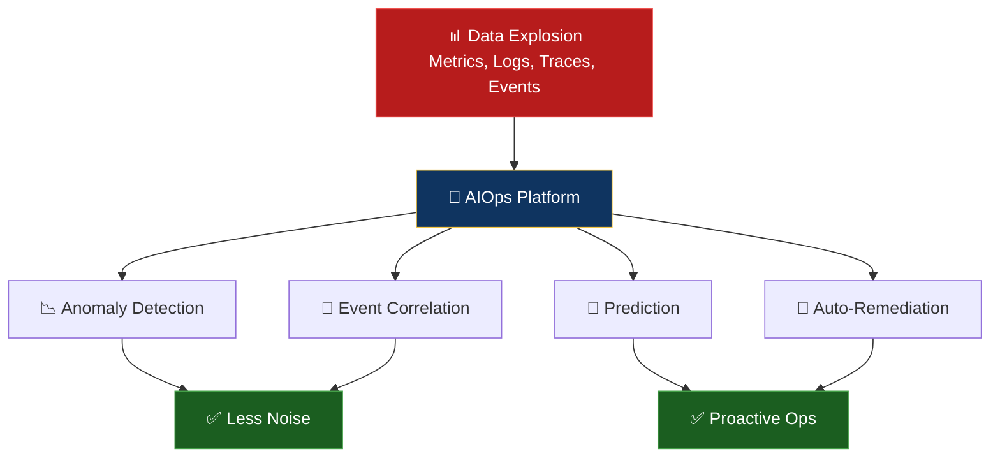

# 🧠 AIOps Fundamentals

> **AIOps uses artificial intelligence to automate and enhance IT operations — reducing noise, accelerating diagnosis, and enabling proactive operations.**

  
  
  

---

## 📖 Conceptual Overview

### The Problem AIOps Solves

Modern systems generate **overwhelming data**:
- A medium company: **1 TB of observability data/day**
- A large company: **100 TB+/day**
- Humans can't process this. Machines can.

### AIOps Maturity Model

| Level | Name | Description | Example |
|:-----:|------|-------------|---------|
| **0** | Reactive | Manual monitoring, alert storms | "Why are there 500 alerts?" |
| **1** | Proactive | Threshold-based alerting | "CPU > 80% → alert" |
| **2** | Predictive | ML anomaly detection | "CPU pattern is abnormal for Tuesday 2PM" |
| **3** | Autonomous | Self-healing automation | "Detected anomaly → auto-scaled → resolved" |
| **4** | Cognitive | LLM-powered operations | "AI summarized the incident and suggested RCA" |

---

## 🔑 Key Concepts

### AIOps Capabilities

| Capability | What It Does | Techniques |
|-----------|-------------|-----------|
| **Anomaly Detection** | Find unusual patterns | Statistical methods, Isolation Forest, Autoencoders |
| **Event Correlation** | Group related alerts | Clustering, graph analysis, temporal correlation |
| **Root Cause Analysis** | Find the "why" | Causal inference, dependency graphs |
| **Noise Reduction** | Suppress duplicate/related alerts | Deduplication, intelligent grouping |
| **Predictive Alerting** | Alert before problems occur | Time-series forecasting, trend analysis |
| **Auto-Remediation** | Fix known issues automatically | Runbook automation, playbooks |
| **NLP/LLM for Ops** | Summarize incidents, query logs | GPT, fine-tuned models |

### AIOps Tool Landscape

| Category | Open Source | Commercial |
|----------|-----------|------------|
| **ML Platform** | MLflow, Kubeflow | SageMaker, Vertex AI |
| **Anomaly Detection** | Prophet, Luminaire | Datadog, Dynatrace |
| **Log Analysis** | ELK, Loki | Splunk, Sumo Logic |
| **Event Correlation** | Custom (Python) | BigPanda, Moogsoft |
| **AIOps Platform** | — | Datadog, Dynatrace, New Relic |

---

## 🏢 Real-world Use Case

### How Microsoft Uses AIOps

Microsoft's **AIOps at Azure** scale:
- **350+ million** Azure AD users monitored
- ML models detect anomalies across thousands of metrics
- **Automated RCA** reduces MTTR by 50%
- Models trained on historical incident data to predict future issues

---

## 📚 Further Reading

| Resource | Type | Description |
|----------|------|-------------|
| [Gartner AIOps Guide](https://www.gartner.com/en/information-technology/glossary/aiops-artificial-intelligence-operations) | 📖 Reference | Industry definition |
| [AIOps Foundation](https://www.aiops.foundation/) | 🌐 Community | Community resources |
| [MLflow](https://mlflow.org/) | 🔧 Tool | ML lifecycle management |
| [Prophet](https://facebook.github.io/prophet/) | 🔧 Tool | Time-series forecasting |

---

  <a href="../README.md">⬅️ AIOps Home</a> · <a href="../02-anomaly-detection/README.md">Next: Anomaly Detection ➡️</a>

