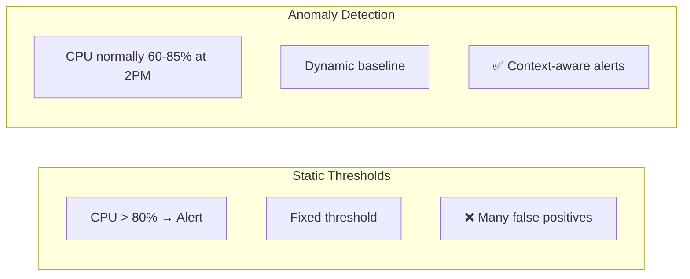
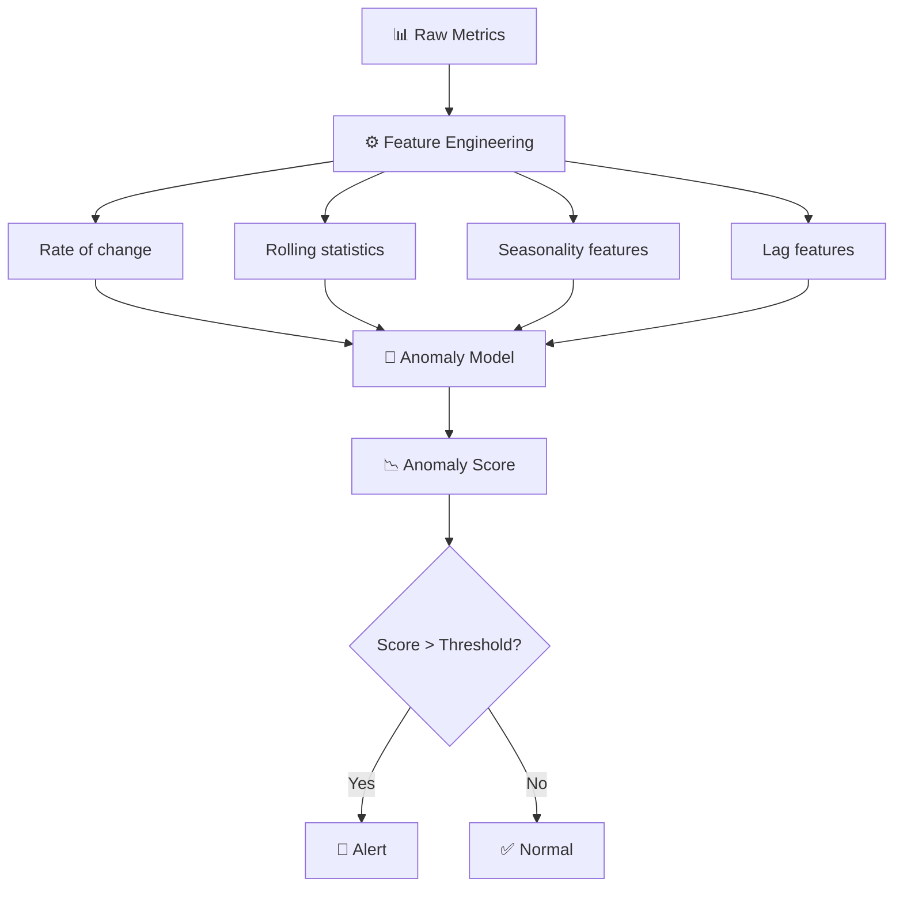

# 📉 Anomaly Detection

> **Anomaly detection identifies data points, events, or patterns that deviate significantly from expected behavior — the foundation of intelligent monitoring.**

<p align="center">
  
  
  
</p>

---

## 📋 Table of Contents

- [Conceptual Overview](#-conceptual-overview)
- [Key Concepts](#-key-concepts)
- [Hands-on Lab](#-hands-on-lab)
- [Real-world Use Case](#-real-world-use-case)
- [Common Pitfalls](#-common-pitfalls)
- [Further Reading](#-further-reading)

---

## 📖 Conceptual Overview

Traditional monitoring uses **static thresholds**: alert if CPU > 80%. But real systems are dynamic — 80% CPU at 3 AM is abnormal, while 80% during peak hours is normal.

Anomaly detection learns **what "normal" looks like** and alerts when behavior deviates.



### Types of Anomalies

| Type | Description | Example |
|------|-------------|---------|
| **Point Anomaly** | Single data point is abnormal | Latency spike to 10s |
| **Contextual Anomaly** | Abnormal in context, normal otherwise | High CPU on Sunday at 3 AM |
| **Collective Anomaly** | A sequence of points is abnormal | Gradual memory leak over days |

---

## 🔑 Key Concepts

### Anomaly Detection Approaches

| Approach | How It Works | Pros | Cons |
|----------|-------------|------|------|
| **Statistical** | Z-score, IQR, moving averages | Simple, fast, interpretable | Assumes normal distribution |
| **Machine Learning** | Isolation Forest, One-Class SVM | Handles complex patterns | Needs training data |
| **Deep Learning** | LSTM, Autoencoders | Catches temporal patterns | Complex, needs GPU |
| **Ensemble** | Combine multiple methods | More robust | Higher complexity |

### Feature Selection for Metrics



---

## 🔧 Hands-on Lab

### Lab: Build an Anomaly Detector for Metrics

**Objective:** Build a Python-based anomaly detector that can identify anomalies in time-series metrics using multiple methods.

#### Prerequisites

```bash
pip install numpy pandas scikit-learn matplotlib
```

#### The Script

👉 **Full working script:** [anomaly_detector.py](./scripts/anomaly_detector.py)

**What it does:**
1. Generates synthetic metrics data with injected anomalies
2. Implements 3 detection methods:
   - **Z-Score** (statistical)
   - **Isolation Forest** (ML)
   - **Rolling statistics** (moving average + std deviation)
3. Compares detection accuracy across methods
4. Generates visualization

#### Run It

```bash
cd 03-aiops/02-anomaly-detection/scripts
python anomaly_detector.py
```

#### Expected Output

```
=== Anomaly Detection Results ===
Method: Z-Score
  Detected: 12 anomalies | Precision: 85.7% | Recall: 92.3%

Method: Isolation Forest
  Detected: 15 anomalies | Precision: 80.0% | Recall: 100.0%

Method: Rolling Statistics
  Detected: 10 anomalies | Precision: 90.0% | Recall: 69.2%
```

---

## 🏢 Real-world Use Case

### How Netflix Detects Anomalies

Netflix's anomaly detection system handles **billions of data points daily**:

1. **Robust Statistical Methods** — They use Robust PCA (robust principal component analysis) to separate normal patterns from anomalies
2. **Seasonality-aware** — Their system understands daily, weekly, and even holiday patterns
3. **Multi-dimensional** — Anomalies are detected across multiple metrics simultaneously
4. **Real-time** — Detection happens in near real-time using stream processing

**Tools used:** Atlas (custom), Mantis (real-time stream processing)

### How Uber Detects Anomalies

Uber's approach:
- Custom system called **Argos** 
- Handles **millions of time series**
- Uses seasonal decomposition + statistical tests
- Considers **spatial context** (anomaly in one city vs global)

---

## ⚠️ Common Pitfalls

| # | Pitfall | Why It Happens | How to Avoid |
|---|---------|---------------|--------------|
| 1 | **Too many false positives** | Threshold too sensitive | Start conservative, tune based on feedback |
| 2 | **Ignoring seasonality** | Using simple Z-score on seasonal data | Decompose time series first |
| 3 | **Cold start problem** | No baseline data for new services | Use statistical methods initially |
| 4 | **Concept drift** | System behavior changes over time | Retrain models periodically |
| 5 | **Alert fatigue** | Too many anomaly alerts | Add suppression, correlation, and severity |
| 6 | **One-size-fits-all** | Same model for all metrics | Different metrics need different approaches |

> 💡 **Pro Tip:** Start with simple statistical methods (Z-score, moving averages). Only move to ML when you've exhausted statistical approaches. Complexity should earn its keep.

---

## 📚 Further Reading

| Resource | Type | Description |
|----------|------|-------------|
| [Netflix Anomaly Detection](https://netflixtechblog.com/rad-outlier-detection-on-big-data-d6b0ff32f0f0) | 📝 Blog | Netflix's RAD system |
| [Uber's Argos](https://www.uber.com/en-US/blog/argos-real-time-alerts/) | 📝 Blog | Uber's anomaly detection platform |
| [scikit-learn Outlier Detection](https://scikit-learn.org/stable/modules/outlier_detection.html) | 📖 Docs | ML-based approaches |
| [Luminaire](https://github.com/zillow/luminaire) | 🔧 Tool | Zillow's anomaly detection library |
| [Prophet](https://facebook.github.io/prophet/) | 🔧 Tool | Meta's forecasting library |
| [Anomaly Detection Survey](https://arxiv.org/abs/2009.02062) | 📄 Paper | Comprehensive academic survey |

---

<p align="center">
  <a href="../README.md">⬅️ AIOps Home</a>
</p>
