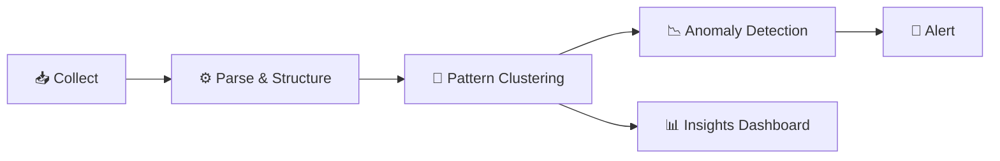

# 📝 Log Intelligence

> **Log intelligence uses NLP and ML to extract actionable insights from the massive volumes of log data that modern systems generate.**

<p align="center">
  
  
</p>

---

## 📖 Conceptual Overview

### The Log Data Challenge

```
Traditional: grep through gigabytes of unstructured text
Intelligent: ML automatically clusters, parses, and highlights anomalies
```

| Traditional Log Analysis | Log Intelligence |
|-------------------------|-----------------|
| Manual grep/awk | Automated pattern discovery |
| Keyword-based search | Semantic search |
| Static parsing rules | ML-based auto-parsing |
| Human reads every log | AI surfaces anomalies |

---

## 🔑 Key Concepts

### Log Intelligence Pipeline



### Key Techniques

| Technique | Purpose | Tools |
|-----------|---------|-------|
| **Log Parsing** | Structure unstructured logs | Drain3, Logstash Grok |
| **Pattern Clustering** | Group similar log lines | k-means, DBSCAN |
| **Anomaly Detection** | Find unusual log patterns | Isolation Forest, DeepLog |
| **Semantic Search** | Natural language log queries | Embeddings + Vector DB |
| **Root Cause Mining** | Correlate logs with incidents | Causal analysis |

### Structured vs Unstructured Logging

```json
// ❌ Unstructured (hard for ML)
"2025-01-15 10:30:45 ERROR Payment failed for user 12345 - timeout"

// ✅ Structured (ML-friendly)
{
  "timestamp": "2025-01-15T10:30:45Z",
  "level": "ERROR",
  "service": "payment",
  "message": "Payment failed",
  "user_id": "12345",
  "error_type": "timeout",
  "trace_id": "abc-123-def",
  "duration_ms": 5000
}
```

> 💡 **Pro Tip:** Always use structured (JSON) logging. It makes ML-based analysis orders of magnitude more effective.

---

## 🏢 Real-world Use Case

### How Uber Analyzes Logs at Scale

- **Volume:** Petabytes of logs per day
- **Tool:** Custom log search platform (M3 + Kafka + Elasticsearch)
- **ML models** automatically identify new error patterns
- **Log-to-metric conversion** — extract metrics from log patterns
- **Automated anomaly detection** on log volume and error patterns

---

## 📚 Further Reading

| Resource | Type | Description |
|----------|------|-------------|
| [ELK Stack](https://www.elastic.co/elastic-stack/) | 🔧 Tool | Elasticsearch + Logstash + Kibana |
| [Grafana Loki](https://grafana.com/oss/loki/) | 🔧 Tool | Log aggregation by Grafana Labs |
| [Drain3](https://github.com/logpai/Drain3) | 🔧 Tool | Online log parsing by IBM |
| [DeepLog Paper](https://www.cs.utah.edu/~lifeifei/papers/deeplog.pdf) | 📄 Paper | Deep learning for log anomaly |
| [LogHub](https://github.com/logpai/loghub) | 📊 Dataset | Log datasets for research |

---

<p align="center">
  <a href="../03-intelligent-alerting/README.md">⬅️ Previous: Alerting</a> · <a href="../README.md">AIOps Home</a> · <a href="../05-llmops/README.md">Next: LLMOps ➡️</a>
</p>
