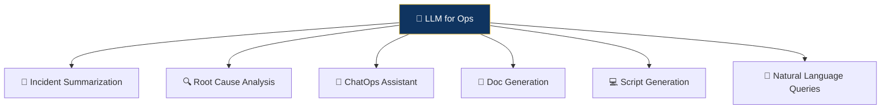
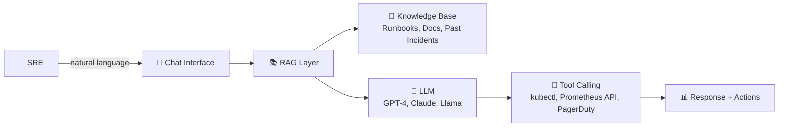

# 🤖 LLMOps

> **LLMOps applies Large Language Models to IT operations — enabling natural language incident summarization, automated RCA, and conversational ops.**

<p align="center">
  
  
  
</p>

---

## 📖 Conceptual Overview

LLMOps is the intersection of **Large Language Models** and **IT Operations**. LLMs bring natural language understanding to ops workflows.

### LLMOps Use Cases



| Use Case | Input | Output |
|----------|-------|--------|
| **Incident Summarization** | Alert data + logs + timeline | Executive summary + impact assessment |
| **Root Cause Suggestion** | Error logs + metrics + topology | Ranked list of probable root causes |
| **Runbook Generation** | Past incidents + remediation steps | Auto-generated runbook drafts |
| **ChatOps** | "What's the error rate for payment service?" | Natural language answer with data |
| **Postmortem Draft** | Incident timeline + logs | Structured postmortem template |
| **Log Explanation** | Stack trace or error log | Plain-English explanation |

---

## 🔑 Key Concepts

### LLMOps Architecture



### RAG for Operations (Retrieval-Augmented Generation)

| Component | Purpose | Tools |
|-----------|---------|-------|
| **Vector DB** | Store embeddings of docs/runbooks | Pinecone, Weaviate, Chroma |
| **Embeddings** | Convert text to searchable vectors | OpenAI, Sentence Transformers |
| **Retriever** | Find relevant context | Similarity search, hybrid search |
| **LLM** | Generate answers with context | GPT-4, Claude, Llama 3 |

### Responsible LLMOps

```
⚠️ LLMs can hallucinate. In operations, hallucinations can cause outages.

Safety Guidelines:
1. NEVER auto-execute LLM-generated commands without human review
2. Use RAG to ground responses in your actual documentation
3. Always show confidence scores and citations
4. Start with read-only operations (summarize, explain, search)
5. Graduate to write operations only after extensive testing
```

---

## 🏢 Real-world Use Case

### How Companies Use LLMs for Ops

**Microsoft (Copilot for Azure):**
- Natural language queries for Azure resources
- "Show me VMs with high CPU in the last hour"
- Generates KQL queries from natural language

**PagerDuty (AIOps + Generative AI):**
- Auto-generates incident summaries from alert data
- Suggests similar past incidents and their resolutions
- Drafts status page updates

**Grafana (AI/LLM features):**
- Natural language → PromQL/LogQL query generation
- "Show me the error rate for the auth service this week"
- AI-powered root cause suggestions from metrics

---

## ⚠️ Common Pitfalls

| # | Pitfall | How to Avoid |
|---|---------|-------------|
| 1 | Trusting LLM output blindly | Always verify; use RAG for grounding |
| 2 | Sending production data to external LLMs | Use self-hosted models or ensure data privacy |
| 3 | No fallback when LLM fails | Always have manual workflows as backup |
| 4 | Over-automating with LLMs too early | Start with assisted mode (suggestions only) |

---

## 📚 Further Reading

| Resource | Type | Description |
|----------|------|-------------|
| [LangChain](https://langchain.com/) | 🔧 Framework | Build LLM-powered applications |
| [LlamaIndex](https://www.llamaindex.ai/) | 🔧 Framework | RAG framework for enterprise data |
| [Ollama](https://ollama.ai/) | 🔧 Tool | Run LLMs locally |
| [k8sGPT](https://k8sgpt.ai/) | 🔧 Tool | AI-powered Kubernetes troubleshooting |
| [Holmes](https://github.com/robusta-dev/holmesgpt) | 🔧 Tool | Open-source AI for incident investigation |

---

<p align="center">
  <a href="../04-log-intelligence/README.md">⬅️ Previous: Log Intelligence</a> · <a href="../README.md">AIOps Home</a> · <a href="../06-predictive-scaling/README.md">Next: Predictive Scaling ➡️</a>
</p>
