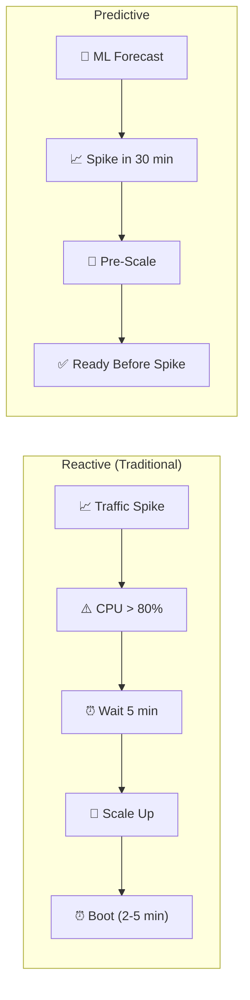
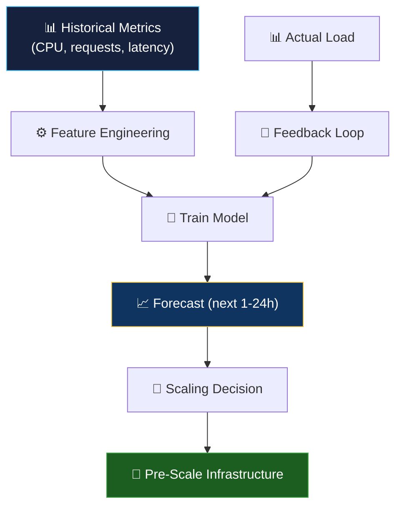

# ⚡ Predictive Scaling

> **Predictive scaling uses ML to forecast demand and proactively adjust infrastructure capacity — scaling before the traffic arrives, not after.**

<p align="center">
  
  
</p>

---

## 📖 Conceptual Overview

### Reactive vs Predictive Scaling



| Feature | Reactive | Predictive |
|---------|:--------:|:----------:|
| **Response Time** | 5-10 min delay | Pre-emptive (0 delay) |
| **User Impact** | Possible degradation during scale-up | None — capacity ready |
| **Cold Start** | Users hit cold instances | Instances warm and ready |
| **Cost** | May over-provision "just in case" | Right-sized to prediction |

---

## 🔑 Key Concepts

### Forecasting Techniques

| Technique | Best For | Tools |
|-----------|---------|-------|
| **ARIMA/SARIMA** | Stationary time series with seasonality | statsmodels |
| **Prophet** | Business time series with holidays | Meta Prophet |
| **LSTM** | Complex non-linear patterns | TensorFlow, PyTorch |
| **Holt-Winters** | Trend + seasonality | statsmodels |
| **AWS Predictive Scaling** | EC2 Auto Scaling | Built into AWS |

### Predictive Scaling Architecture



### AWS Predictive Scaling (Built-in)

```bash
# Enable predictive scaling on AWS Auto Scaling Group
aws autoscaling put-scaling-policy \
  --auto-scaling-group-name my-asg \
  --policy-name my-predictive-policy \
  --policy-type PredictiveScaling \
  --predictive-scaling-configuration '{
    "MetricSpecifications": [{
      "TargetValue": 70,
      "PredefinedMetricPairSpecification": {
        "PredefinedMetricType": "ASGCPUUtilization"
      }
    }],
    "Mode": "ForecastAndScale",
    "SchedulingBufferTime": 300
  }'
```

---

## 🏢 Real-world Use Case

### How Netflix Pre-Scales for New Releases

- **Problem:** A new show launch can cause 10x traffic spike in minutes
- **Solution:** ML model trained on historical launch patterns
- **Action:** Pre-scale 2 hours before estimated launch peak
- **Result:** Zero degradation during launches like "Stranger Things"

### How Uber Predicts Ride Demand

- Forecasts demand per city zone in 15-minute windows
- Pre-positions drivers and scales backend services accordingly
- Uses time-series models + external signals (weather, events, holidays)

---

## ⚠️ Common Pitfalls

| # | Pitfall | How to Avoid |
|---|---------|-------------|
| 1 | Over-fitting to historical patterns | Use cross-validation; account for trend changes |
| 2 | Ignoring special events | Feed event calendars into models (holidays, launches) |
| 3 | No fallback to reactive scaling | Predictive + reactive should work together |
| 4 | Scaling too aggressively on false predictions | Set maximum scale-up limits; use confidence intervals |

---

## 📚 Further Reading

| Resource | Type | Description |
|----------|------|-------------|
| [AWS Predictive Scaling](https://docs.aws.amazon.com/autoscaling/ec2/userguide/ec2-auto-scaling-predictive-scaling.html) | 📖 Docs | AWS built-in predictive scaling |
| [Prophet](https://facebook.github.io/prophet/) | 🔧 Tool | Meta's forecasting library |
| [KEDA](https://keda.sh/) | 🔧 Tool | K8s event-driven autoscaling |
| [Google Autopilot](https://cloud.google.com/kubernetes-engine/docs/concepts/autopilot-overview) | 🔧 Tool | GKE managed scaling |

---

<p align="center">
  <a href="../05-llmops/README.md">⬅️ Previous: LLMOps</a> · <a href="../README.md">AIOps Home</a>
</p>
