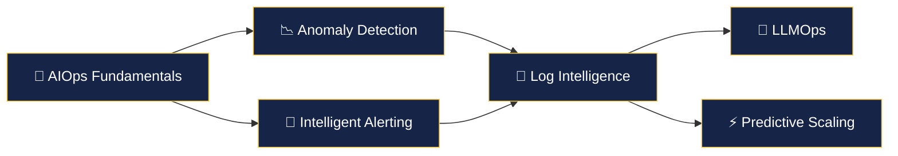

# 🤖 AIOps — Intelligent Operations

> **AIOps applies artificial intelligence and machine learning to IT operations, automating the detection, diagnosis, and resolution of operational issues.**

---

## 🗺️ Learning Path



---

## 📚 Modules

| # | Module | Description | Difficulty | Status |
|---|--------|-------------|------------|--------|
| 01 | [**AIOps Fundamentals**](./01-aiops-fundamentals/) | What is AIOps, maturity model | 🟢 Beginner | ✅ |
| 02 | [**Anomaly Detection**](./02-anomaly-detection/) | Statistical & ML approaches | 🔴 Advanced | ✅ |
| 03 | [**Intelligent Alerting**](./03-intelligent-alerting/) | Alert correlation, noise reduction | 🔴 Advanced | ✅ |
| 04 | [**Log Intelligence**](./04-log-intelligence/) | Log parsing, pattern recognition | 🔴 Advanced | ✅ |
| 05 | [**LLMOps**](./05-llmops/) | LLMs for ops, incident summarization | 🔴 Advanced | ✅ |
| 06 | [**Predictive Scaling**](./06-predictive-scaling/) | Forecasting, proactive auto-scaling | 🔴 Advanced | ✅ |

---

## 🎯 AIOps Maturity Model

```
Level 0: Reactive      → Manual monitoring, alert-driven
Level 1: Proactive     → Threshold-based alerting, dashboards
Level 2: Predictive    → ML-based anomaly detection, forecasting
Level 3: Autonomous    → Self-healing, auto-remediation
Level 4: Cognitive     → LLM-powered RCA, natural language ops
```

> ⚠️ **Note:** AIOps is a rapidly evolving field. Content marked with 🔄 may change as tools and techniques mature.

---

## 💡 Key Principles

| Principle | Description |
|-----------|-------------|
| 🎯 **Data Quality First** | ML models are only as good as the data they learn from |
| 📊 **Start Simple** | Statistical methods before deep learning |
| 🔄 **Feedback Loops** | Humans in the loop to improve model accuracy |
| 🚫 **No Black Boxes** | Explainability matters — ops teams must trust the AI |
| 📈 **Measure Impact** | Track MTTR reduction, false positive rates |

---

## 📖 Recommended Resources

- 📘 *Practical AIOps* — Peco Karayanev
- 📗 *Machine Learning for Operations* — Various authors
- 📙 [Google's ML for Systems](https://research.google/pubs/pub46518/) — Research papers

---

<p align="center">
  <a href="../02-sre/README.md">⬅️ Previous: SRE</a> · <a href="../README.md">Home</a>
</p>
