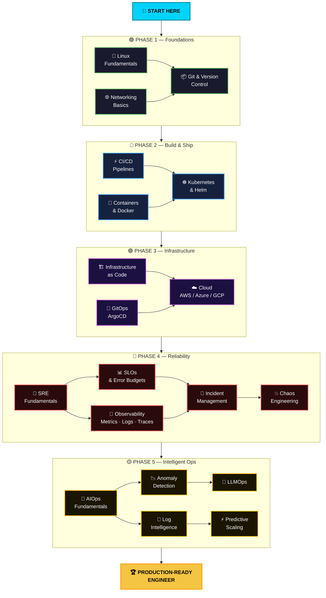

<p align="center">
  
</p>

<p align="center">
  <strong>🎯 Your ultimate open-source roadmap — from absolute beginner to production-ready engineer.</strong>
  <br />
  <sub>100+ files · 23 deep-dive modules · 9 cheatsheets · 10 projects · Real-world scripts</sub>
</p>

<p align="center">
  <a href="https://github.com/thejas0501/zero-to-sre/stargazers"></a>
  <a href="https://github.com/thejas0501/zero-to-sre/network/members"></a>
  <a href="https://github.com/thejas0501/zero-to-sre/blob/main/LICENSE"></a>
  <a href="https://github.com/thejas0501/zero-to-sre/pulls"></a>
  <a href="https://github.com/thejas0501/zero-to-sre/issues"></a>
</p>

<p align="center">
  
  
  
  
  
  
  
  
  
  
  
  
</p>

---

## 🎯 What is Zero to SRE?

**Zero to SRE** is a free, open-source, community-driven knowledge base that takes you from absolute beginner to production-ready expertise across **four critical pillars** of modern infrastructure:

<table>
<tr>
<td align="center" width="25%">

### 🔧 DevOps
**Build & Ship**
<br />
CI/CD · Containers · K8s
IaC · GitOps · Platform

</td>
<td align="center" width="25%">

### ☁️ Cloud
**Deploy Anywhere**
<br />
AWS · Azure · GCP
Multi-Cloud · Cost Ops

</td>
<td align="center" width="25%">

### 🔥 SRE
**Run & Reliability**
<br />
SLOs · Observability
Chaos · Incidents

</td>
<td align="center" width="25%">

### 🤖 AIOps
**Intelligent Ops**
<br />
Anomaly Detection
LLMOps · Prediction

</td>
</tr>
</table>

> **📖 Every module includes:** Concepts → 🔧 Hands-on Labs → 🏢 Real-world Cases → ⚠️ Pitfalls → 📚 Further Reading

---

## 🗺️ Learning Roadmap

> **Follow the path. Master each phase. Become production-ready.** 🚀



<p align="center">
  <sub>🟢 Foundations → 🔵 Build & Ship → 🟣 Infrastructure → 🔴 Reliability → 🟡 Intelligent Ops → 🏆 Production-Ready</sub>
</p>

---

## 📂 Repository Structure

```
zero-to-sre/
│
├── 🔧 01-devops/                      # DevOps Pillar (10 modules)
│   ├── 01-linux-fundamentals/         ✅  + system healthcheck script
│   ├── 02-networking-basics/          ✅  + network debug toolkit
│   ├── 03-git-version-control/        ✅
│   ├── 04-ci-cd-pipelines/            ✅  (GitHub Actions, Jenkins, GitLab CI)
│   ├── 05-containerization/           ✅  (Dockerfile, Compose, Podman)
│   ├── 06-container-orchestration/    ✅  (K8s manifests + Helm chart)
│   ├── 07-infrastructure-as-code/     ✅  (Terraform AWS/Azure/GCP + Ansible)
│   ├── 08-gitops/                     ✅  (ArgoCD + FluxCD)
│   ├── 09-platform-engineering/       ✅
│   └── 10-cloud-engineering/          ✅  ☁️ AWS + Azure + GCP
│
├── 🔥 02-sre/                         # SRE Pillar (7 modules)
│   ├── 01-sre-fundamentals/           ✅
│   ├── 02-slos-slas-slis/             ✅  + SLO tracker script
│   ├── 03-observability/              ✅  (Prometheus + Grafana + Jaeger + ELK)
│   ├── 04-incident-management/        ✅  (Templates + 4 runbooks)
│   ├── 05-chaos-engineering/          ✅  + LitmusChaos experiments
│   ├── 06-capacity-planning/          ✅  + k6 load test script
│   └── 07-toil-reduction/             ✅
│
├── 🤖 03-aiops/                       # AIOps Pillar (6 modules)
│   ├── 01-aiops-fundamentals/         ✅
│   ├── 02-anomaly-detection/          ✅  + Python ML script
│   ├── 03-intelligent-alerting/       ✅
│   ├── 04-log-intelligence/           ✅  + log analyzer script
│   ├── 05-llmops/                     ✅
│   └── 06-predictive-scaling/         ✅  + forecasting script
│
├── 📋 cheatsheets/                    # 6 Quick References
│   ├── kubectl, docker, terraform, linux, git, prometheus
│
├── 🎓 interview-prep/                # 4 Interview Guides
│   ├── devops, sre, kubernetes, system-design
│
├── 🏆 labs/                           # Hands-on Projects
│   └── end-to-end-lab.md             ✅  (Capstone: build → deploy → monitor → chaos)
│
├── ⚙️ .github/                       # Repository Infrastructure
│   ├── workflows/docs-ci.yml         ✅  (Lint, link check, security)
│   ├── ISSUE_TEMPLATE/               ✅  (Bug report, module request)
│   └── PULL_REQUEST_TEMPLATE.md      ✅
│
├── LICENSE                            MIT
├── CHANGELOG.md                       v1.0.0 release notes
├── CONTRIBUTING.md
└── CODE_OF_CONDUCT.md
```

---

## 📚 Module Overview

### 🔧 DevOps — Build & Ship

| # | Module | Description | Difficulty | Status |
|---|--------|-------------|------------|--------|
| 01 | [**Linux Fundamentals**](./01-devops/01-linux-fundamentals/) | Shell, file systems, processes, permissions | 🟢 Beginner | ✅ Complete |
| 02 | [**Networking Basics**](./01-devops/02-networking-basics/) | TCP/IP, DNS, load balancing, firewalls | 🟢 Beginner | ✅ Complete |
| 03 | [**Git & Version Control**](./01-devops/03-git-version-control/) | Branching strategies, rebasing, monorepos | 🟢 Beginner | ✅ Complete |
| 04 | [**CI/CD Pipelines**](./01-devops/04-ci-cd-pipelines/) | GitHub Actions, Jenkins, GitLab CI, multi-stage pipelines | 🟡 Intermediate | ✅ Complete |
| 05 | [**Containerization**](./01-devops/05-containerization/) | Docker, multi-stage builds, security, Compose | 🟡 Intermediate | ✅ Complete |
| 06 | [**Container Orchestration**](./01-devops/06-container-orchestration/) | Kubernetes, Helm, operators, service mesh | 🔴 Advanced | ✅ Complete |
| 07 | [**Infrastructure as Code**](./01-devops/07-infrastructure-as-code/) | Terraform, Pulumi, state management, modules | 🟡 Intermediate | ✅ Complete |
| 08 | [**GitOps**](./01-devops/08-gitops/) | ArgoCD, FluxCD, progressive delivery | 🔴 Advanced | ✅ Complete |
| 09 | [**Platform Engineering**](./01-devops/09-platform-engineering/) | IDPs, Backstage, golden paths | 🔴 Advanced | ✅ Complete |
| 10 | [**☁️ Cloud Engineering**](./01-devops/10-cloud-engineering/) | AWS, Azure, GCP — services, CLI, architecture, cost optimization | 🟡 Intermediate | ✅ Complete |

### 🔥 SRE — Run & Reliability

| # | Module | Description | Difficulty | Status |
|---|--------|-------------|------------|--------|
| 01 | [**SRE Fundamentals**](./02-sre/01-sre-fundamentals/) | Google's SRE philosophy, error budgets, risk | 🟢 Beginner | ✅ Complete |
| 02 | [**SLOs / SLAs / SLIs**](./02-sre/02-slos-slas-slis/) | Defining, measuring, and alerting on service levels | 🟡 Intermediate | ✅ Complete |
| 03 | [**Observability**](./02-sre/03-observability/) | Metrics, logs, traces — Prometheus, Grafana, OTel | 🟡 Intermediate | ✅ Complete |
| 04 | [**Incident Management**](./02-sre/04-incident-management/) | On-call, runbooks, postmortems, severity levels | 🟡 Intermediate | ✅ Complete |
| 05 | [**Chaos Engineering**](./02-sre/05-chaos-engineering/) | Litmus, Chaos Monkey, game days, blast radius | 🔴 Advanced | ✅ Complete |
| 06 | [**Capacity Planning**](./02-sre/06-capacity-planning/) | Load testing, resource forecasting, scaling strategies | 🔴 Advanced | ✅ Complete |
| 07 | [**Toil Reduction**](./02-sre/07-toil-reduction/) | Automation, self-healing, eliminating repetitive work | 🟡 Intermediate | ✅ Complete |

### 🤖 AIOps — Intelligent Operations

| # | Module | Description | Difficulty | Status |
|---|--------|-------------|------------|--------|
| 01 | [**AIOps Fundamentals**](./03-aiops/01-aiops-fundamentals/) | What is AIOps, maturity model, tools landscape | 🟢 Beginner | ✅ Complete |
| 02 | [**Anomaly Detection**](./03-aiops/02-anomaly-detection/) | Statistical methods, ML approaches, time-series | 🔴 Advanced | ✅ Complete |
| 03 | [**Intelligent Alerting**](./03-aiops/03-intelligent-alerting/) | Alert correlation, noise reduction, smart routing | 🔴 Advanced | ✅ Complete |
| 04 | [**Log Intelligence**](./03-aiops/04-log-intelligence/) | Log parsing, pattern recognition, NLP on logs | 🔴 Advanced | ✅ Complete |
| 05 | [**LLMOps**](./03-aiops/05-llmops/) | LLMs for ops, incident summarization, RCA | 🔴 Advanced | ✅ Complete |
| 06 | [**Predictive Scaling**](./03-aiops/06-predictive-scaling/) | Forecasting demand, proactive auto-scaling | 🔴 Advanced | ✅ Complete |

### 📋 Quick References & Interview Prep

| Resource | Description |
|----------|-------------|
| [kubectl Cheatsheet](./cheatsheets/kubectl-cheatsheet.md) | Essential Kubernetes commands |
| [Docker Cheatsheet](./cheatsheets/docker-cheatsheet.md) | Container management quick reference |
| [Terraform Cheatsheet](./cheatsheets/terraform-cheatsheet.md) | IaC workflow and patterns |
| [Linux Cheatsheet](./cheatsheets/linux-cheatsheet.md) | Essential CLI commands |
| [Git Cheatsheet](./cheatsheets/git-cheatsheet.md) | Branching, merging, undoing mistakes |
| [Prometheus/PromQL Cheatsheet](./cheatsheets/prometheus-cheatsheet.md) | Golden Signals queries and alerting |
| [☁️ Cloud CLI Cheatsheet](./cheatsheets/cloud-cli-cheatsheet.md) | AWS, Azure, GCP commands side-by-side |
| [Helm Cheatsheet](./cheatsheets/helm-cheatsheet.md) | Install, upgrade, debug, chart development |
| [DevOps Interview Q&A](./interview-prep/devops-questions.md) | Beginner to advanced questions |
| [SRE Interview Q&A](./interview-prep/sre-questions.md) | Google-style SRE interview prep |
| [Kubernetes Interview Q&A](./interview-prep/kubernetes-questions.md) | Pods, networking, security, debugging |
| [☁️ Cloud Interview Q&A](./interview-prep/cloud-questions.md) | AWS, Azure, GCP — beginner to advanced |
| [System Design Scenarios](./interview-prep/system-design-scenarios.md) | Infrastructure design practice |
| [🏆 End-to-End Capstone Lab](./labs/end-to-end-lab.md) | Build → Deploy → Monitor → Chaos → Postmortem |

---

## 🚀 Quick Start

```bash
# Clone the repository
git clone https://github.com/thejas0501/zero-to-sre.git
cd zero-to-sre

# Start with your first module
# If you're a beginner:
cat 01-devops/04-ci-cd-pipelines/README.md

# If you're intermediate:
cat 02-sre/03-observability/README.md

# If you're advanced:
cat 03-aiops/02-anomaly-detection/README.md
```

---

## 🏗️ How Each Module is Structured

Every module in this repository follows a consistent, battle-tested format:

```
📖 Conceptual Explanation
   └── What it is, why it matters, how it works
   
🔧 Hands-on Lab
   └── Step-by-step instructions with real tools
   
🏢 Real-world Use Case
   └── How companies like Google, Netflix, Meta use this
   
⚠️ Common Pitfalls
   └── Mistakes that trip up even experienced engineers
   
📚 Further Reading
   └── Curated links to deepen your understanding
```

---

## 🤝 Contributing

We love contributions! Whether it's fixing a typo, adding a new module, or improving an existing one — every contribution matters.

Please read our [Contributing Guide](./CONTRIBUTING.md) and [Code of Conduct](./CODE_OF_CONDUCT.md) before submitting.

### Ways to Contribute

| Type | Description |
|------|-------------|
| 📝 **Documentation** | Fix typos, improve explanations, add diagrams |
| 💻 **Code** | Add scripts, configs, or automation examples |
| 🧪 **Labs** | Create hands-on exercises and projects |
| 🐛 **Issues** | Report bugs or suggest improvements |
| 🌟 **Star** | Star this repo to show your support! |

---

## 📖 Philosophy

This project is guided by principles borrowed from the best:

- **📘 Google SRE Book** — "Hope is not a strategy"
- **🔄 DevOps Handbook** — "Automate everything, measure everything"
- **🧪 Chaos Engineering** — "Break things on purpose, in production"
- **🤖 AIOps** — "Let machines handle the noise, humans handle the signal"

---

## 🌟 Star History

<p align="center">
  <a href="https://star-history.com/#thejas0501/zero-to-sre&Date">
    
  </a>
</p>

---

## 📜 License

This project is licensed under the [MIT License](./LICENSE) — use it, share it, build upon it.

---

## 👨‍💻 Author

<div align="center">


<br />

### 🚀 **K A THEJAS**

#### **DevOps Engineer | Cloud Engineer**

<br />

<a href="https://github.com/thejas0501"></a>
<a href="https://linkedin.com/in/thejas0501"></a>
<a href="mailto:thejas0501@gmail.com"></a>

<br /><br />

**🛠️ Tech Stack & Expertise**


<br />


<br /><br />

> *🔧 Passionate about building reliable, scalable, and automated cloud infrastructure.*
> *📚 This repository is my contribution to the DevOps & SRE community — built from real-world experience and industry best practices.*

<br />

</div>

---

<p align="center">
  <strong>Built with ❤️ by K A THEJAS for the DevOps & SRE community</strong>
  <br />
  <sub>If this helped you, consider giving it a ⭐ — it helps others find it too!</sub>
  <br /><br />
  
  
  
</p>

