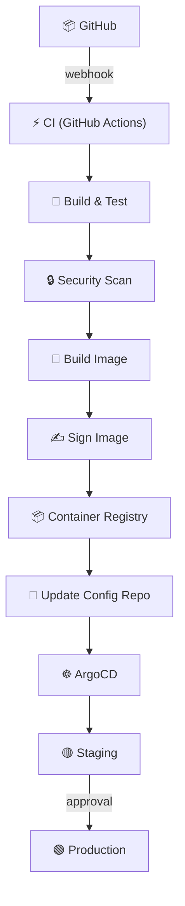
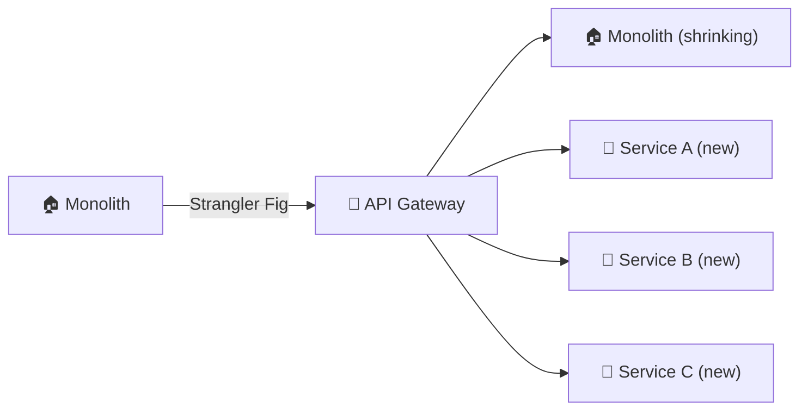

# 🎓 System Design Scenarios for DevOps/SRE

> Practice scenarios for infrastructure and reliability-focused system design interviews.

---

## Scenario 1: Design a CI/CD Platform

### Requirements
- Support 500+ engineers, 200+ microservices
- < 10 minute pipeline for most services
- Secure (no secrets in code, signed images)
- Multi-environment: dev → staging → production

### Key Design Decisions



**Discussion points:** Caching strategy, parallel pipelines, canary analysis, rollback mechanisms, cost optimization, pipeline as code vs GUI.

---

## Scenario 2: Design a Monitoring Stack for 1000 Microservices

### Requirements
- Metrics, logs, and traces for 1000 services
- < 30 second delay from event to dashboard
- 30-day retention for metrics, 7 days for logs
- Alert on SLO violations

### Architecture

```
Services → OpenTelemetry Collector → {
  Metrics  → Prometheus/Thanos → Grafana
  Logs     → Kafka → Loki → Grafana
  Traces   → Tempo → Grafana
}
Alert Manager → PagerDuty / Slack
```

**Discussion points:** Cardinality management, data sampling, cost at scale, multi-cluster federation, SLO-based alerting vs threshold alerting.

---

## Scenario 3: Design a Disaster Recovery Strategy

### Requirements
- RPO (Recovery Point Objective): < 1 hour
- RTO (Recovery Time Objective): < 4 hours
- Multi-region (active-passive or active-active)
- Cost-effective

### Key Components

| Component | Strategy |
|-----------|---------|
| **Database** | Cross-region async replication + daily snapshots |
| **Application** | Multi-region deployment behind Global LB |
| **DNS** | Route 53 health checks + failover routing |
| **IaC** | All infra in Terraform → recreate in minutes |
| **Secrets** | Replicated Vault cluster |
| **Testing** | Quarterly DR drills |

**Discussion points:** Active-active vs active-passive tradeoffs, data consistency during failover, cost of maintaining standby region, automation of failover process.

---

## Scenario 4: Design a Self-Healing Kubernetes Platform

### Requirements
- Auto-recover from common failures
- Minimize human intervention
- Support 100+ namespaces, 50+ teams

### Self-Healing Capabilities

| Failure | Auto-Recovery |
|---------|--------------|
| Pod crash | Restart policy + liveness probes |
| Node failure | Pod rescheduling + cluster autoscaler |
| Disk full | Log rotation + alerting + PVC auto-expansion |
| Certificate expiry | cert-manager auto-renewal |
| Image pull failure | Fallback to last-known-good image |
| Resource exhaustion | HPA + VPA + resource quotas |

**Discussion points:** Blast radius limits, circuit breakers between auto-remediation actions, human approval for destructive actions, learning from auto-remediation events.

---

## Scenario 5: Migrate a Monolith to Microservices

### Approach



**Key decisions:** Start with the easiest-to-extract service, not the most critical. Use the strangler fig pattern. Shared database → database-per-service (eventual). Feature flags for traffic shifting.

---

## 💡 Framework for System Design Interviews

```
1. REQUIREMENTS (5 min)
   - Functional requirements (what it does)
   - Non-functional requirements (scale, latency, availability)
   
2. HIGH-LEVEL DESIGN (10 min)
   - Draw the architecture diagram
   - Identify core components
   
3. DEEP DIVE (15 min)
   - Pick 2-3 components to discuss in detail
   - Trade-offs and alternatives
   
4. OPERATIONS (5 min)
   - How to monitor it
   - How to deploy changes
   - How to handle failures
   - How to scale
```

---

> 💡 **Tip:** Always discuss trade-offs. There's no perfect design — interviewers want to see your reasoning process, not a textbook answer.
