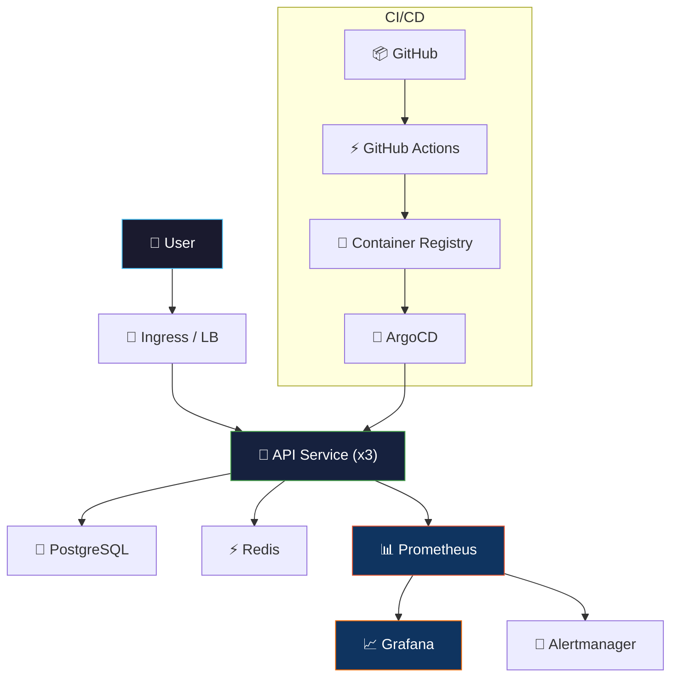

# 🏆 End-to-End Lab: Build, Deploy & Monitor a Microservice

> **The capstone project that ties everything together — from writing code to production observability.**

<p align="center">
  
  
  
</p>

---

## 🎯 Objective

Build, containerize, deploy, and monitor a REST API from scratch — using the tools and practices from every module in this repository.

## 🏗️ Architecture



---

## 📋 Prerequisites

| Tool | Installation | Verify |
|------|-------------|--------|
| Docker | [docker.com](https://docs.docker.com/get-docker/) | `docker --version` |
| kubectl | [kubernetes.io](https://kubernetes.io/docs/tasks/tools/) | `kubectl version --client` |
| minikube or kind | [minikube.sigs.k8s.io](https://minikube.sigs.k8s.io/docs/start/) | `minikube version` |
| Helm | [helm.sh](https://helm.sh/docs/intro/install/) | `helm version` |
| Terraform | [terraform.io](https://developer.hashicorp.com/terraform/install) | `terraform version` |
| Git | Pre-installed | `git --version` |

---

## 🔧 Lab Steps

### Phase 1: Build (Modules 3, 4, 5)

#### Step 1.1: Create the Repository

```bash
mkdir myapp && cd myapp
git init
git checkout -b main
```

#### Step 1.2: Write a Simple API

Create `app.js`:

```javascript
const express = require('express');
const prom = require('prom-client');
const app = express();

// Prometheus metrics
const collectDefaultMetrics = prom.collectDefaultMetrics;
collectDefaultMetrics();

const httpRequestDuration = new prom.Histogram({
  name: 'http_request_duration_seconds',
  help: 'Duration of HTTP requests',
  labelNames: ['method', 'route', 'status'],
  buckets: [0.01, 0.05, 0.1, 0.5, 1, 5],
});

const httpRequestTotal = new prom.Counter({
  name: 'http_requests_total',
  help: 'Total HTTP requests',
  labelNames: ['method', 'route', 'status'],
});

// Middleware: instrument all requests
app.use((req, res, next) => {
  const end = httpRequestDuration.startTimer();
  res.on('finish', () => {
    end({ method: req.method, route: req.route?.path || req.path, status: res.statusCode });
    httpRequestTotal.inc({ method: req.method, route: req.route?.path || req.path, status: res.statusCode });
  });
  next();
});

// Routes
app.get('/health', (req, res) => res.json({ status: 'ok', timestamp: new Date() }));
app.get('/api/v1/items', (req, res) => res.json([{ id: 1, name: 'item-1' }]));
app.get('/metrics', async (req, res) => {
  res.set('Content-Type', prom.register.contentType);
  res.end(await prom.register.metrics());
});

app.listen(3000, () => console.log('🚀 Server running on :3000'));
```

#### Step 1.3: Containerize

Create `Dockerfile` following the patterns from Module 5:

```dockerfile
FROM node:20-alpine AS builder
WORKDIR /app
COPY package*.json ./
RUN npm ci --only=production

FROM node:20-alpine
RUN addgroup -S app && adduser -S app -G app
WORKDIR /app
COPY --from=builder /app/node_modules ./node_modules
COPY . .
USER app
EXPOSE 3000
HEALTHCHECK --interval=30s CMD wget -qO- http://localhost:3000/health || exit 1
CMD ["node", "app.js"]
```

### Phase 2: Deploy (Modules 6, 7, 8)

#### Step 2.1: Start Local Cluster

```bash
minikube start --cpus=2 --memory=4096
# OR
kind create cluster --name lab
```

#### Step 2.2: Deploy with Kubernetes Manifests

Use the manifests from Module 6 (`k8s-manifests/`) as templates. Apply:

```bash
kubectl create namespace production
kubectl apply -f k8s-manifests/
kubectl get all -n production
```

#### Step 2.3: Verify

```bash
kubectl port-forward svc/myapp 8080:80 -n production
curl http://localhost:8080/health
curl http://localhost:8080/metrics
```

### Phase 3: Monitor (SRE Modules 2, 3, 4)

#### Step 3.1: Deploy Prometheus Stack

```bash
helm repo add prometheus-community https://prometheus-community.github.io/helm-charts
helm install monitoring prometheus-community/kube-prometheus-stack -n monitoring --create-namespace
```

#### Step 3.2: Import Dashboard

Import the Golden Signals dashboard from `02-sre/03-observability/grafana/golden-signals-dashboard.json`.

#### Step 3.3: Define SLOs

Based on Module 2, define your SLOs:
- **Availability SLO:** 99.9% (error budget: 43 min/month)
- **Latency SLO:** p95 < 300ms

#### Step 3.4: Create Alert Rules

Apply the alert rules from `02-sre/03-observability/prometheus/alert-rules.yml`.

### Phase 4: Break Things (SRE Module 5)

#### Step 4.1: Run Chaos Experiment

```bash
# Kill a pod — does the service self-heal?
kubectl delete pod -l app=myapp -n production

# Watch recovery
kubectl get pods -n production -w
```

#### Step 4.2: Load Test

```bash
# Run the k6 load test from Module 6
k6 run 02-sre/06-capacity-planning/scripts/load-test.js
```

### Phase 5: Postmortem Practice

After your chaos experiment:
1. Use the postmortem template from `02-sre/04-incident-management/templates/postmortem-template.md`
2. Document what happened, what worked, what didn't
3. Create action items

---

## ✅ Completion Checklist

- [ ] Application code written with Prometheus metrics
- [ ] Docker image built and tested locally
- [ ] Deployed to Kubernetes with 3+ replicas
- [ ] Readiness and liveness probes configured
- [ ] Prometheus scraping application metrics
- [ ] Grafana dashboard showing 4 Golden Signals
- [ ] SLOs defined and error budget calculated
- [ ] Alert rules deployed
- [ ] Chaos experiment executed (pod kill)
- [ ] Load test run with k6
- [ ] Postmortem document written

---

## 🏆 Bonus Challenges

| Challenge | Module Reference |
|-----------|-----------------|
| Set up ArgoCD for GitOps deployment | Module 8 |
| Add HPA to auto-scale on traffic | Module 6 |
| Implement Network Policies | Module 6 |
| Add the anomaly detection script to monitor metrics | AIOps Module 2 |
| Create a CI/CD pipeline in GitHub Actions | Module 4 |

---

<p align="center">
  <strong>Congratulations! You've gone from Zero to SRE. 🎉</strong>
</p>
